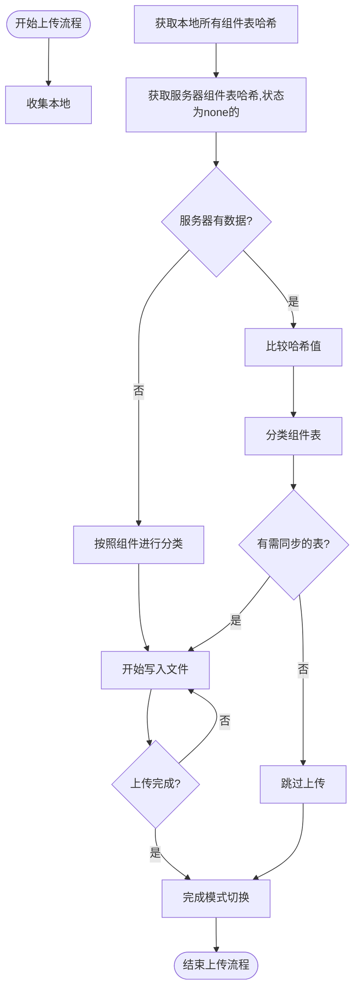

```mermaid

flowchart TD
    Start([开始上传流程]) --> CollectData[收集本地]
    CollectLocalHashes[获取本地所有组件表哈希]
    CollectLocalHashes --> FetchServerHashes[获取服务器组件表哈希,状态为none的]
    
    FetchServerHashes --> ServerHasData{服务器有数据?}
    
    ServerHasData -->|是| CompareHashes[比较哈希值]
    ServerHasData -->|否| ClassifyTables2[按照组件进行分类]
    ClassifyTables2 --> StartBatching[开始写入文件]
    
    CompareHashes --> ClassifyTables[分类组件表]
    ClassifyTables --> HasChanges{有需同步的表?}
    
    HasChanges -->|否| SkipUpload[跳过上传]
    HasChanges -->|是| StartBatching
    
    StartBatching --> UploadComplete{上传完成?}


    UploadComplete -->|是| FinalizeMode[完成模式切换]
    UploadComplete -->|否| StartBatching

    
    
    FinalizeMode --> End([结束上传流程])
    
    SkipUpload --> FinalizeMode


```