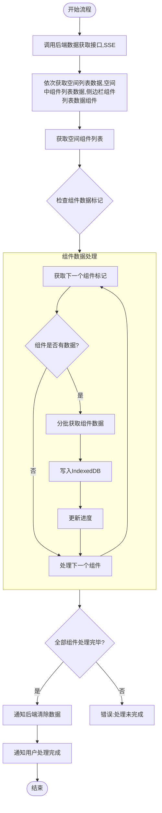

```mermaid

flowchart TD
    Start([开始流程]) --> FetchData[调用后端数据获取接口,SSE]
    FetchData --> FetchSpaceData[依次获取空间列表数据,空间中组件列表数据,侧边栏组件列表数据组件]
    FetchSpaceData --> FetchComponentList[获取空间组件列表]
    FetchComponentList --> CheckComponentData{检查组件数据标记}
    
    subgraph ComponentProcess [组件数据处理]
        direction TB
        A[获取下一个组件标记] --> B{组件是否有数据?}
        B -->|否| NextComponent[处理下一个组件]
        B -->|是| C[分批获取组件数据]
        C --> D[写入IndexedDB]
        D --> UpdateProgress[更新进度]
        UpdateProgress --> NextComponent
        NextComponent --> A
    end
    
    CheckComponentData --> ComponentProcess
    ComponentProcess --> AllComponentsProcessed{全部组件处理完毕?}
    
    AllComponentsProcessed -->|是| ClearServerData[通知后端清除数据]
    AllComponentsProcessed -->|否| Error3[错误:处理未完成]
    
    ClearServerData --> CompletionNotification[通知用户处理完成]
    CompletionNotification --> End([结束])

```