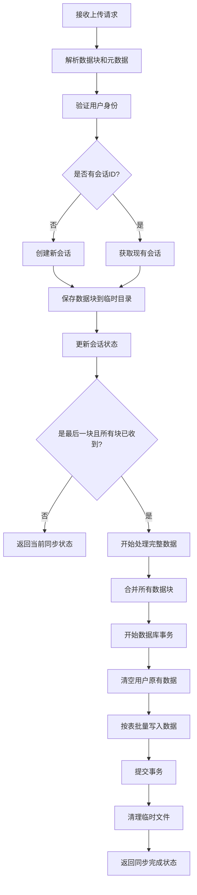

```mermaid
flowchart TD
    A[接收上传请求] --> B[解析数据块和元数据]
    B --> C[验证用户身份]
    C --> D{是否有会话ID?}
    D -->|否| E[创建新会话]
    D -->|是| F[获取现有会话]
    E --> G[保存数据块到临时目录]
    F --> G
    G --> H[更新会话状态]
    H --> I{是最后一块且所有块已收到?}
    I -->|否| J[返回当前同步状态]
    I -->|是| K[开始处理完整数据]
    K --> L[合并所有数据块]
    L --> M[开始数据库事务]
    M --> N[清空用户原有数据]
    N --> O[按表批量写入数据]
    O --> P[提交事务]
    P --> Q[清理临时文件]
    Q --> R[返回同步完成状态]
```