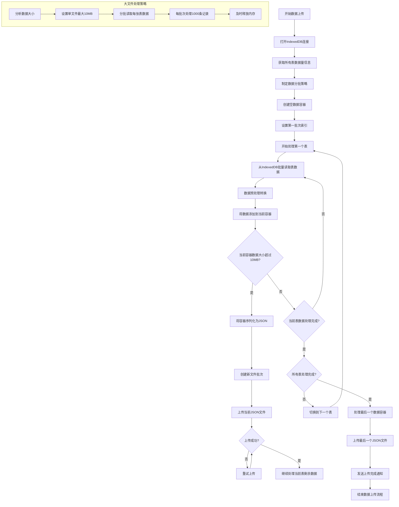

```mermaid
flowchart TD
    A[开始数据上传] --> B[打开IndexedDB连接]
    B --> C[获取所有表数据量信息]
    C --> D[制定数据分批策略]
    D --> E[创建空数据容器]
    E --> F[设置第一批次索引]
    
    F --> G[开始处理第一个表]
    G --> H[从IndexedDB批量读取表数据]
    H --> I[数据预处理转换]
    I --> J[将数据添加到当前容器]
    
    J --> K{当前容器数据大小超过10MB?}
    K -->|是| L[将容器序列化为JSON]
    L --> M[创建新文件批次]
    M --> N[上传当前JSON文件]
    N --> O{上传成功?}
    
    O -->|否| P[重试上传]
    P --> O
    
    O -->|是| Q[继续处理当前表剩余数据]
    K -->|否| R{当前表数据处理完成?}
    
    R -->|否| H
    R -->|是| S{所有表处理完成?}
    
    S -->|否| T[切换到下一个表]
    T --> G
    
    S -->|是| U[处理最后一个数据容器]
    U --> V[上传最后一个JSON文件]
    V --> W[发送上传完成通知]
    W --> X[结束数据上传流程]
    
    subgraph 大文件处理策略
    D1[分析数据大小] --> D2[设置单文件最大10MB]
    D2 --> D3[分批读取每张表数据]
    D3 --> D4[每批次处理1000条记录]
    D4 --> D5[及时释放内存]
    end
```