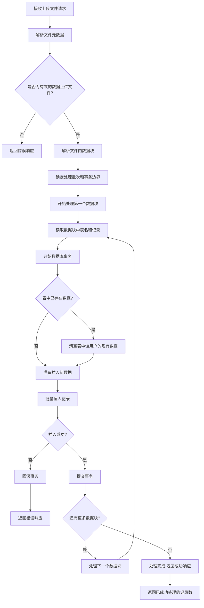

```mermaid
flowchart TD
    A[接收上传文件请求] --> B[解析文件元数据]
    B --> C{是否为有效的数据上传文件?}
    
    C -->|否| D[返回错误响应]
    C -->|是| E[解析文件内数据块]
    
    E --> F[确定处理批次和事务边界]
    F --> G[开始处理第一个数据块]
    
    G --> H[读取数据块中表名和记录]
    H --> I[开始数据库事务]
    
    I --> J{表中已存在数据?}
    J -->|是| K[清空表中该用户的现有数据]
    J -->|否| L[准备插入新数据]
    
    K --> L
    L --> M[批量插入记录]
    
    M --> N{插入成功?}
    N -->|否| O[回滚事务]
    O --> P[返回错误响应]
    
    N -->|是| Q[提交事务]
    Q --> R{还有更多数据块?}
    
    R -->|是| S[处理下一个数据块]
    S --> H
    
    R -->|否| T[处理完成,返回成功响应]
    T --> U[返回已成功处理的记录数]
```