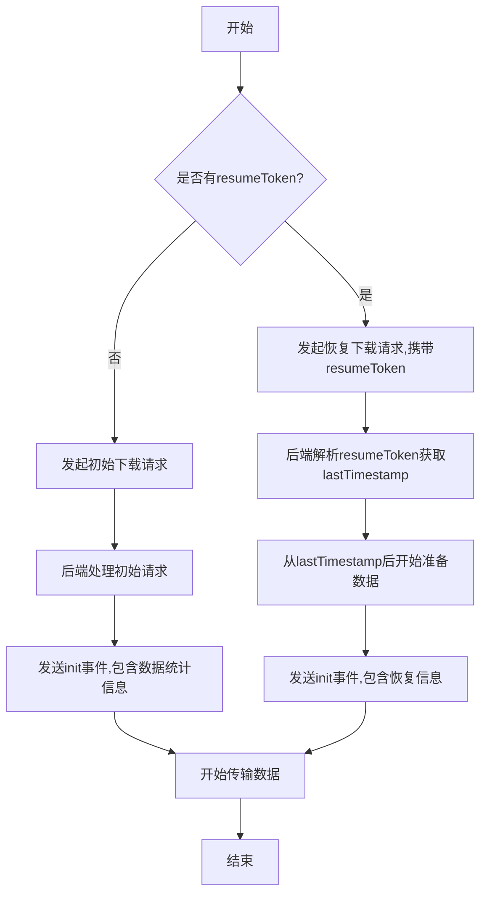

```mermaid
flowchart TD
    A[开始] --> B{是否有resumeToken?}
    B -->|否| C[发起初始下载请求]
    B -->|是| D[发起恢复下载请求,携带resumeToken]
    
    C --> E[后端处理初始请求]
    D --> F[后端解析resumeToken获取lastTimestamp]
    F --> G[从lastTimestamp后开始准备数据]
    
    E --> H[发送init事件,包含数据统计信息]
    G --> I[发送init事件,包含恢复信息]
    
    H --> J[开始传输数据]
    I --> J
    J --> K[结束]
```