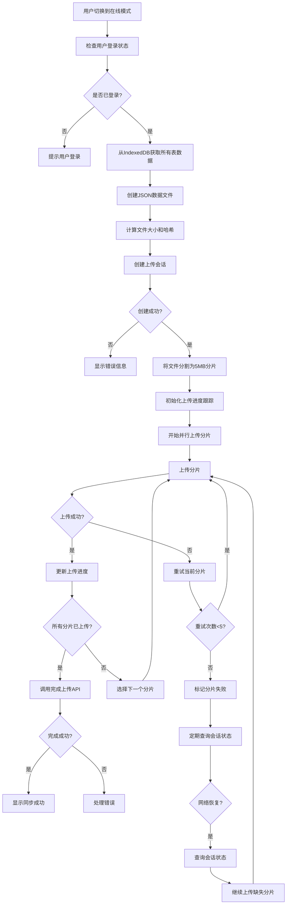

```mermaid
flowchart TD
    A[用户切换到在线模式] --> B[检查用户登录状态]
    B --> C{是否已登录?}
    C -->|否| D[提示用户登录]
    C -->|是| E[从IndexedDB获取所有表数据]
    E --> F[创建JSON数据文件]
    F --> G[计算文件大小和哈希]
    G --> H[创建上传会话]
    H --> I{创建成功?}
    I -->|否| J[显示错误信息]
    I -->|是| K[将文件分割为5MB分片]
    K --> L[初始化上传进度跟踪]
    L --> M[开始并行上传分片]
    M --> N[上传分片]
    N --> O{上传成功?}
    O -->|是| P[更新上传进度]
    O -->|否| Q[重试当前分片]
    Q --> R{重试次数<5?}
    R -->|是| N
    R -->|否| S[标记分片失败]
    S --> T[定期查询会话状态]
    P --> U{所有分片已上传?}
    U -->|否| V[选择下一个分片]
    V --> N
    U -->|是| W[调用完成上传API]
    W --> X{完成成功?}
    X -->|是| Y[显示同步成功]
    X -->|否| Z[处理错误]
    T --> AA{网络恢复?}
    AA -->|是| AB[查询会话状态]
    AB --> AC[继续上传缺失分片]
    AC --> N
```