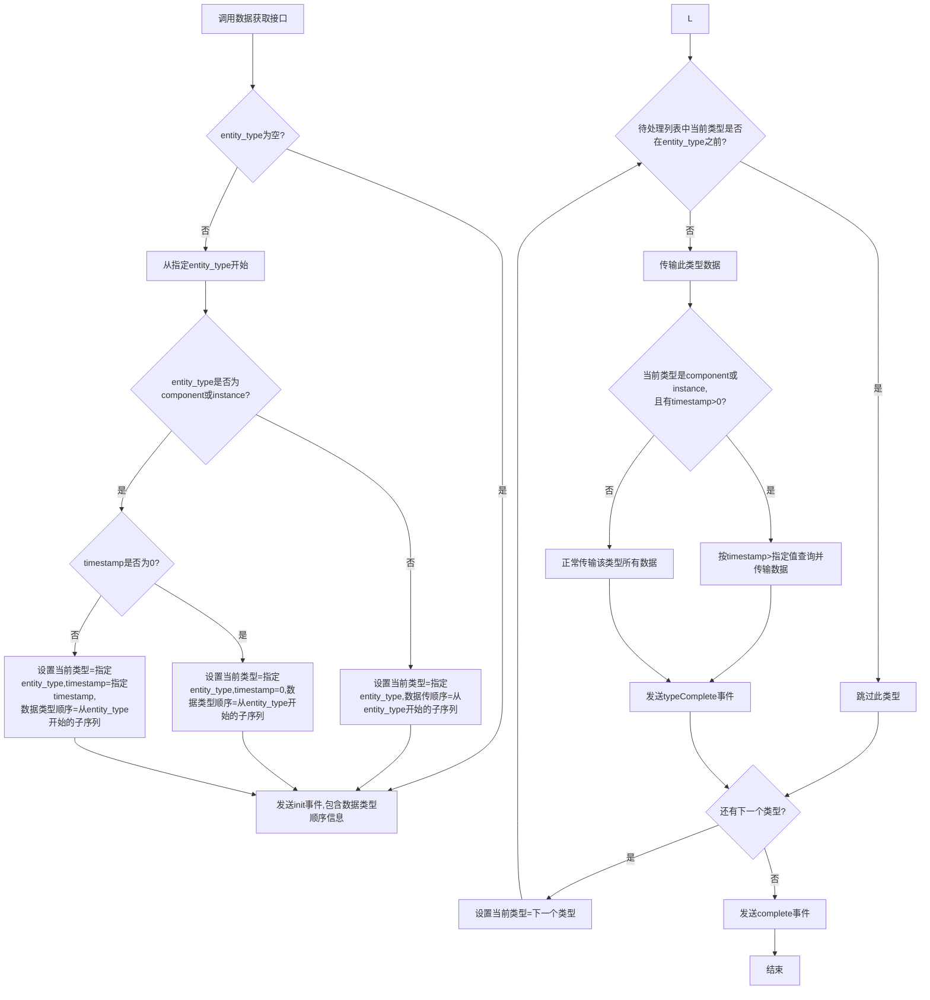

```mermaid
flowchart TD
    A[调用数据获取接口] --> B{entity_type为空?}

    B -->|是| K[发送init事件,包含数据类型顺序信息]
    B -->|否| D[从指定entity_type开始]
    
    D --> F{entity_type是否为component或instance?}
    
    F -->|否| G[设置当前类型=指定entity_type,数据传顺序=从entity_type开始的子序列]
    F -->|是| H{timestamp是否为0?}
    
    H -->|是| I[设置当前类型=指定entity_type,timestamp=0,数据类型顺序=从entity_type开始的子序列]
    H -->|否| J[设置当前类型=指定entity_type,timestamp=指定timestamp,\n数据类型顺序=从entity_type开始的子序列]
    
    G --> K
    I --> K
    J --> K
    
    L --> M{待处理列表中当前类型是否在entity_type之前?}
    M -->|是| N[跳过此类型]
    M -->|否| O[传输此类型数据]
    
    O --> P{当前类型是component或instance,\n且有timestamp>0?}
    P -->|是| Q[按timestamp>指定值查询并传输数据]
    P -->|否| R[正常传输该类型所有数据]
    
    Q --> S[发送typeComplete事件]
    R --> S
    N --> T{还有下一个类型?}
    S --> T
    
    T -->|是| U[设置当前类型=下一个类型]
    T -->|否| V[发送complete事件]
    
    U --> M
    V --> W[结束]
```