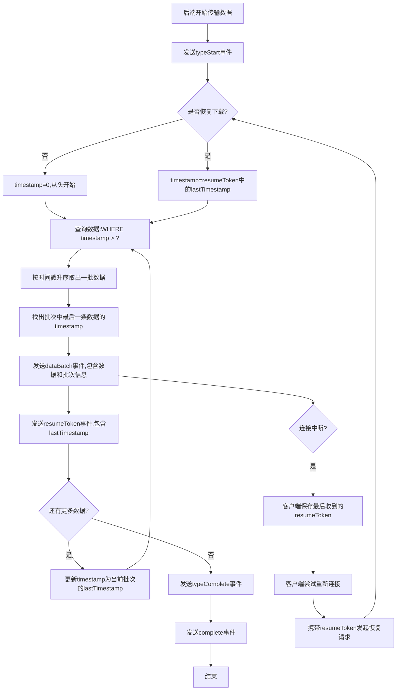

```mermaid
flowchart TD
    A[后端开始传输数据] --> B[发送typeStart事件]
    
    B --> C{是否恢复下载?}
    C -->|否| D[timestamp=0,从头开始]
    C -->|是| E[timestamp=resumeToken中的lastTimestamp]
    
    D --> F[查询数据:WHERE timestamp > ?]
    E --> F
    
    F --> G[按时间戳升序取出一批数据]
    G --> H[找出批次中最后一条数据的timestamp]
    
    H --> I[发送dataBatch事件,包含数据和批次信息]
    I --> J[发送resumeToken事件,包含lastTimestamp]
    
    J --> K{还有更多数据?}
    K -->|是| L[更新timestamp为当前批次的lastTimestamp]
    L --> F
    
    K -->|否| M[发送typeComplete事件]
    M --> N[发送complete事件]
    N --> O[结束]
    
    %% 中断处理
    I --> P{连接中断?}
    P -->|是| Q[客户端保存最后收到的resumeToken]
    Q --> R[客户端尝试重新连接]
    R --> S[携带resumeToken发起恢复请求]
    S --> C
```