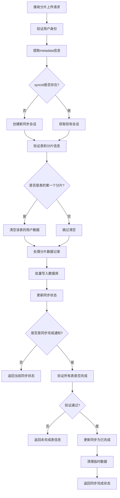

```mermaid
flowchart TD
    A[接收分片上传请求] --> B[验证用户身份]
    B --> C[提取metadata信息]
    C --> D{syncId是否存在?}
    D -->|否| E[创建新同步会话]
    D -->|是| F[获取现有会话]
    E --> G[验证表和分片信息]
    F --> G
    G --> H{是否是表的第一个分片?}
    H -->|是| I[清空该表的用户数据]
    H -->|否| J[跳过清空]
    I --> K[处理分片数据记录]
    J --> K
    K --> L[批量写入数据库]
    L --> M[更新同步状态]
    M --> N{是否是同步完成通知?}
    N -->|否| O[返回当前同步状态]
    N -->|是| P[验证所有表是否完成]
    P --> Q{验证通过?}
    Q -->|否| R[返回未完成表信息]
    Q -->|是| S[更新同步为已完成]
    S --> T[清理临时数据]
    T --> U[返回同步完成状态]
```