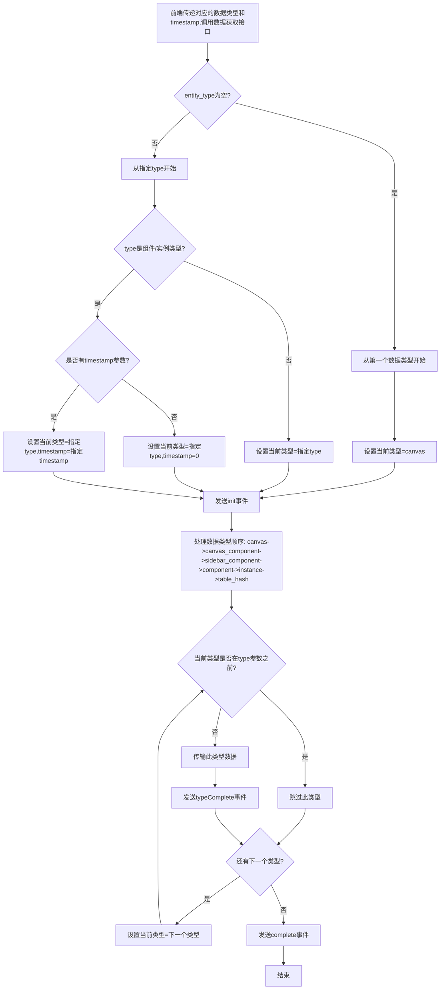

```mermaid
flowchart TD
    A[前端传递对应的数据类型和timestamp,调用数据获取接口] --> B{entity_type为空?}

    B -->|否| D[从指定type开始]
    B -->|是| C[从第一个数据类型开始]
    
    C --> E[设置当前类型=canvas]
    D --> F{type是组件/实例类型?}
    
    F -->|否| G[设置当前类型=指定type]
    F -->|是| H{是否有timestamp参数?}
    
    H -->|否| I[设置当前类型=指定type,timestamp=0]
    H -->|是| J[设置当前类型=指定type,timestamp=指定timestamp]
    
    E --> K[发送init事件]
    G --> K
    I --> K
    J --> K
    
    K --> L[处理数据类型顺序: canvas->canvas_component->sidebar_component->component->instance->table_hash]
    
    L --> M{当前类型是否在type参数之前?}
    M -->|是| N[跳过此类型]
    M -->|否| O[传输此类型数据]
    
    N --> P{还有下一个类型?}
    O --> Q[发送typeComplete事件]
    Q --> P
    
    P -->|是| R[设置当前类型=下一个类型]
    P -->|否| S[发送complete事件]
    
    R --> M
    S --> T[结束]
```