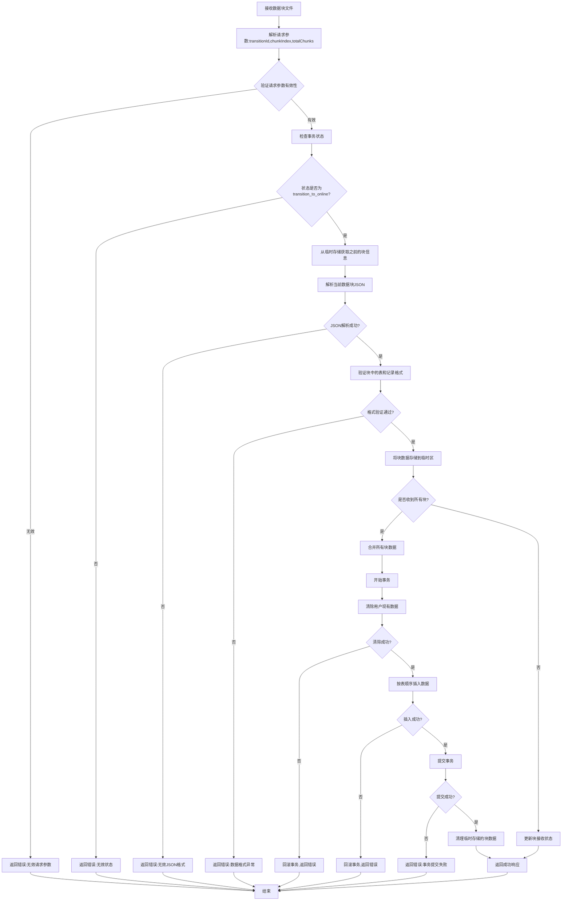

```mermaid
flowchart TD
    A[接收数据块文件] --> B[解析请求参数:transitionId,chunkIndex,totalChunks]
    B --> C{验证请求参数有效性}
    
    C -->|无效| D[返回错误:无效请求参数]
    C -->|有效| E[检查事务状态]
    
    E --> F{状态是否为transition_to_online?}
    F -->|否| G[返回错误:无效状态]
    F -->|是| H[从临时存储获取之前的块信息]
    
    H --> I[解析当前数据块JSON]
    I --> J{JSON解析成功?}
    J -->|否| K[返回错误:无效JSON格式]
    J -->|是| L[验证块中的表和记录格式]
    
    L --> M{格式验证通过?}
    M -->|否| N[返回错误:数据格式异常]
    M -->|是| O[将块数据存储到临时区]
    
    O --> P{是否收到所有块?}
    P -->|否| Q[更新块接收状态]
    P -->|是| R[合并所有块数据]
    
    R --> S[开始事务]
    S --> T[清除用户现有数据]
    
    T --> U{清除成功?}
    U -->|否| V[回滚事务,返回错误]
    U -->|是| W[按表顺序插入数据]
    
    W --> X{插入成功?}
    X -->|否| Y[回滚事务,返回错误]
    X -->|是| Z[提交事务]
    
    Z --> AA{提交成功?}
    AA -->|否| AB[返回错误:事务提交失败]
    AA -->|是| AC[清理临时存储的块数据]
    
    AC --> AD[返回成功响应]
    
    Q --> AD
    
    D --> AE[结束]
    G --> AE
    K --> AE
    N --> AE
    V --> AE
    Y --> AE
    AB --> AE
    AD --> AE
```