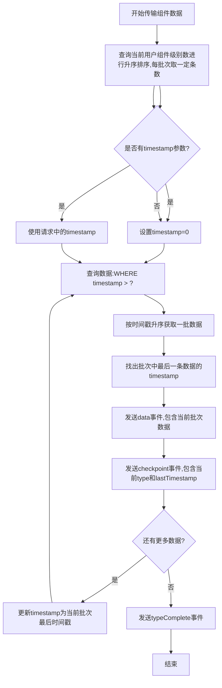

```mermaid
flowchart TD
    A[开始传输组件数据] --> B[查询当前用户组件级别数进行升序排序,每批次取一定条数]
    B --> C{是否还是数据}
    C --> |是| D[推送event=component]
    
    B --> C{是否有timestamp参数?}
    C -->|否| D[设置timestamp=0]
    C -->|是| E[使用请求中的timestamp]
    
    D --> F[查询数据:WHERE timestamp > ?]
    E --> F
    
    F --> G[按时间戳升序获取一批数据]
    G --> H[找出批次中最后一条数据的timestamp]
    
    H --> I[发送data事件,包含当前批次数据]
    I --> J[发送checkpoint事件,包含当前type和lastTimestamp]
    
    J --> K{还有更多数据?}
    K -->|是| L[更新timestamp为当前批次最后时间戳]
    L --> F
    
    K -->|否| M[发送typeComplete事件]
    M --> N[结束]
```