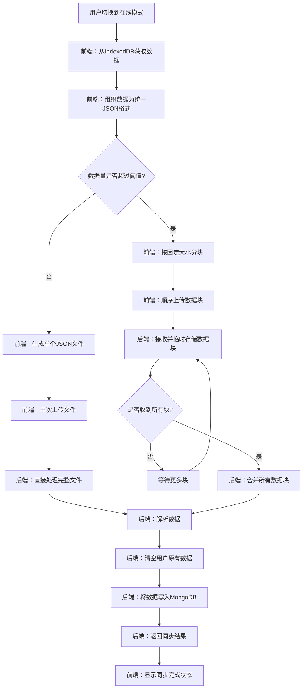

```mermaid
flowchart TD
    A[用户切换到在线模式] --> B[前端：从IndexedDB获取数据]
    B --> C[前端：组织数据为统一JSON格式]
    C --> D{数据量是否超过阈值?}
    D -->|是| E[前端：按固定大小分块]
    D -->|否| F[前端：生成单个JSON文件]
    E --> G[前端：顺序上传数据块]
    F --> H[前端：单次上传文件]
    G --> I[后端：接收并临时存储数据块]
    H --> J[后端：直接处理完整文件]
    I --> K{是否收到所有块?}
    K -->|否| L[等待更多块]
    L --> I
    K -->|是| M[后端：合并所有数据块]
    J --> N[后端：解析数据]
    M --> N
    N --> O[后端：清空用户原有数据]
    O --> P[后端：将数据写入MongoDB]
    P --> Q[后端：返回同步结果]
    Q --> R[前端：显示同步完成状态]
```