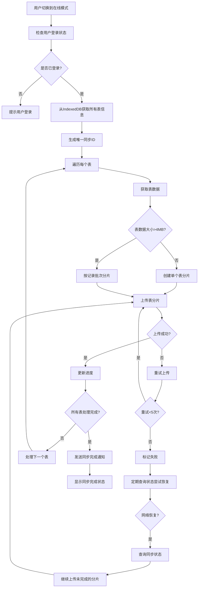

```mermaid
flowchart TD
    A[用户切换到在线模式] --> B[检查用户登录状态]
    B --> C{是否已登录?}
    C -->|否| D[提示用户登录]
    C -->|是| E[从IndexedDB获取所有表信息]
    E --> F[生成唯一同步ID]
    F --> G[遍历每个表]
    G --> H[获取表数据]
    H --> I{表数据大小>4MB?}
    I -->|否| J[创建单个表分片]
    I -->|是| K[按记录批次分片]
    J --> L[上传表分片]
    K --> L
    L --> M{上传成功?}
    M -->|否| N[重试上传]
    N --> O{重试<5次?}
    O -->|是| L
    O -->|否| P[标记失败]
    P --> Q[定期查询状态尝试恢复]
    M -->|是| R[更新进度]
    R --> S{所有表处理完成?}
    S -->|否| T[处理下一个表]
    T --> G
    S -->|是| U[发送同步完成通知]
    U --> V[显示同步完成状态]
    Q --> W{网络恢复?}
    W -->|是| X[查询同步状态]
    X --> Y[继续上传未完成的分片]
    Y --> L
```