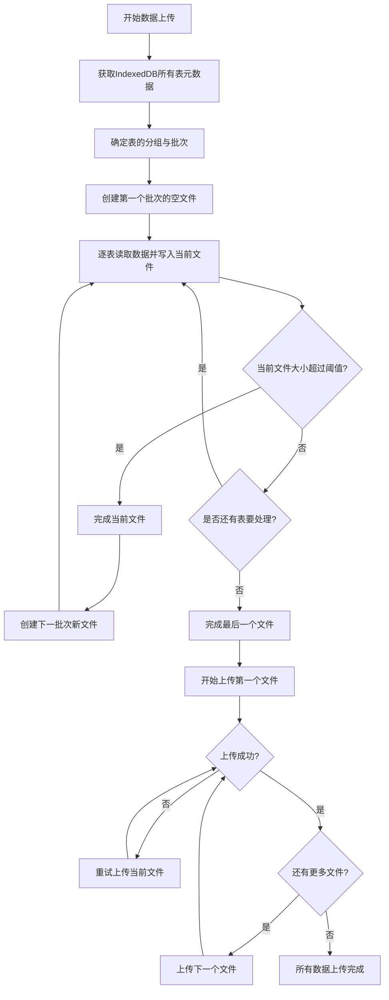

```mermaid
flowchart TD
    A[开始数据上传] --> B[获取IndexedDB所有表元数据]
    B --> C[确定表的分组与批次]
    C --> D[创建第一个批次的空文件]
    D --> E[逐表读取数据并写入当前文件]
    
    E --> F{当前文件大小超过阈值?}
    F -->|是| G[完成当前文件]
    G --> H[创建下一批次新文件]
    H --> E
    
    F -->|否| I{是否还有表要处理?}
    I -->|是| E
    I -->|否| J[完成最后一个文件]
    
    J --> K[开始上传第一个文件]
    K --> L{上传成功?}
    L -->|否| M[重试上传当前文件]
    M --> L
    
    L -->|是| N{还有更多文件?}
    N -->|是| O[上传下一个文件]
    O --> L
    N -->|否| P[所有数据上传完成]
```