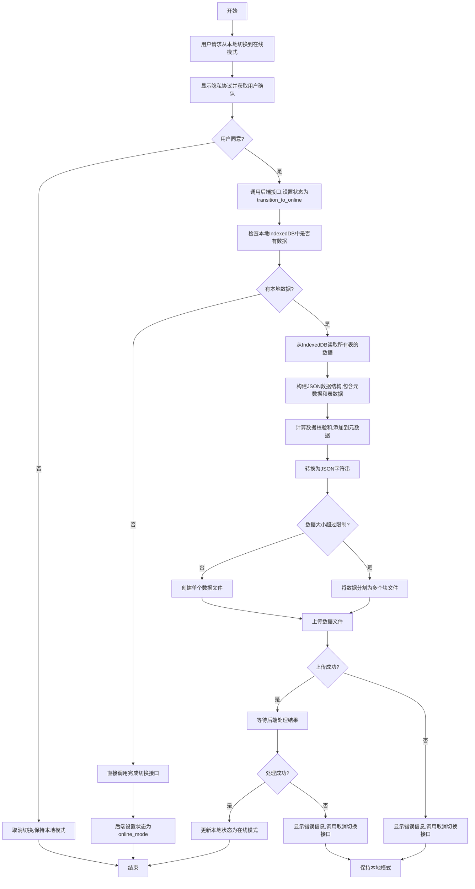

```mermaid
flowchart TD
    A[开始] --> B[用户请求从本地切换到在线模式]
    B --> C[显示隐私协议并获取用户确认]
    C --> D{用户同意?}
    D -->|否| E[取消切换,保持本地模式]
    D -->|是| F[调用后端接口,设置状态为transition_to_online]
    F --> G[检查本地IndexedDB中是否有数据]
    G --> H{有本地数据?}
    
    H -->|否| I[直接调用完成切换接口]
    H -->|是| J[从IndexedDB读取所有表的数据]
    
    J --> K[构建JSON数据结构,包含元数据和表数据]
    K --> L[计算数据校验和,添加到元数据]
    L --> M[转换为JSON字符串]
    
    M --> N{数据大小超过限制?}
    N -->|是| O[将数据分割为多个块文件]
    N -->|否| P[创建单个数据文件]
    
    O --> Q[上传数据文件]
    P --> Q
    I --> R[后端设置状态为online_mode]
    
    Q --> S{上传成功?}
    S -->|否| T[显示错误信息,调用取消切换接口]
    S -->|是| U[等待后端处理结果]
    
    U --> V{处理成功?}
    V -->|否| W[显示错误信息,调用取消切换接口]
    V -->|是| X[更新本地状态为在线模式]
    
    T --> Y[保持本地模式]
    W --> Y
    X --> Z[结束]
    R --> Z
    E --> Z
```