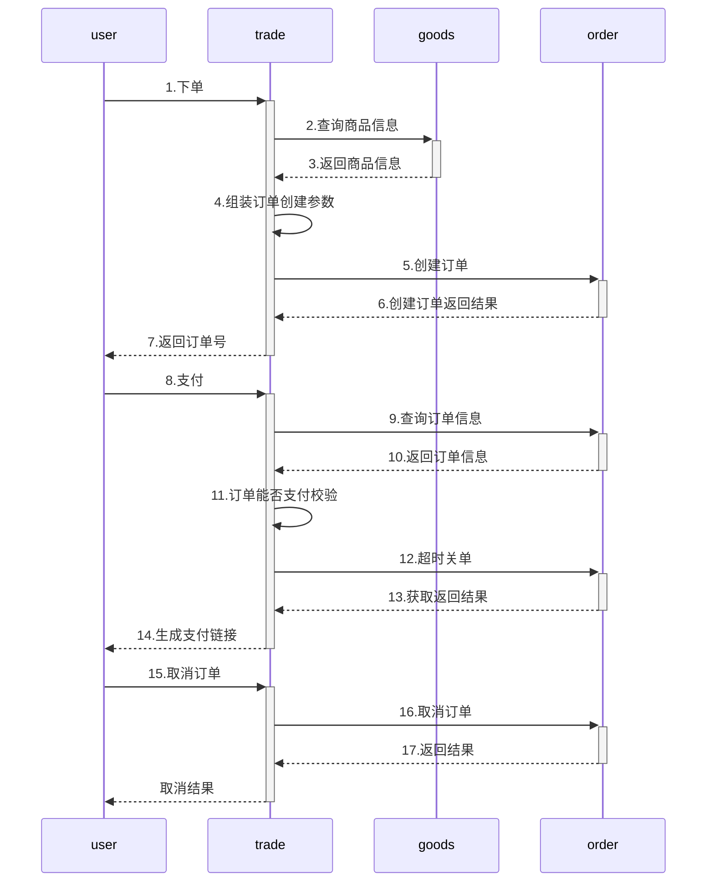

```mermaid
sequenceDiagram
    user->>+trade: 1.下单
    trade->>+goods: 2.查询商品信息
    goods-->>-trade: 3.返回商品信息
    trade->>trade: 4.组装订单创建参数
    trade->>+order: 5.创建订单
    order-->>-trade: 6.创建订单返回结果
    trade-->>-user: 7.返回订单号
    user->>+trade: 8.支付
    trade->>+order: 9.查询订单信息
    order-->>-trade: 10.返回订单信息
    trade->>trade: 11.订单能否支付校验
    
    trade->>+order: 12.超时关单
    order-->>-trade: 13.获取返回结果
    trade-->>-user: 14.生成支付链接
    user->>+trade: 15.取消订单
    trade->>+order: 16.取消订单
    order-->>-trade: 17.返回结果
    trade-->>-user: 取消结果
```