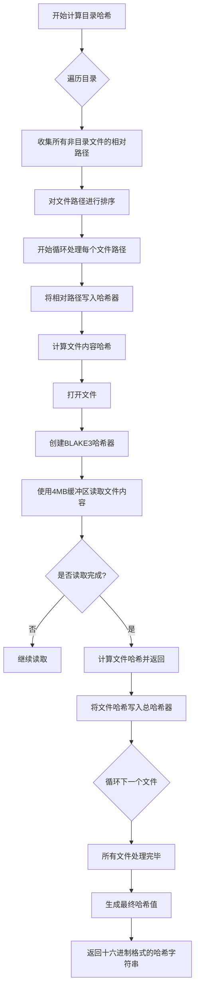

```mermaid
graph TD
    A[开始计算目录哈希] --> B{遍历目录}
    B --> C[收集所有非目录文件的相对路径]
    C --> D[对文件路径进行排序]

    D --> E[开始循环处理每个文件路径]
    E --> F[将相对路径写入哈希器]
    F --> G[计算文件内容哈希]
    G --> H[打开文件]
    H --> I[创建BLAKE3哈希器]
    I --> J[使用4MB缓冲区读取文件内容]
    J --> K{是否读取完成?}
    K -->|否| L[继续读取]
    K -->|是| M[计算文件哈希并返回]

    M --> N[将文件哈希写入总哈希器]
    N --> O{循环下一个文件}

    O --> P[所有文件处理完毕]
    P --> Q[生成最终哈希值]
    Q --> R[返回十六进制格式的哈希字符串]

```