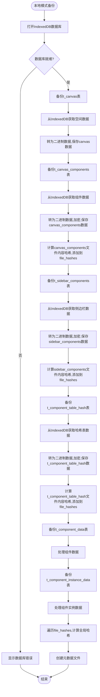

```mermaid

flowchart TD
    Start([本地模式备份]) --> OpenDB[打开IndexedDB数据库]
    OpenDB --> DBReady{数据库就绪?}
    
    DBReady -->|否| ShowDBError[显示数据库错误]
    DBReady -->|是| BackupCanvas[备份t_canvas表]
    
    ShowDBError --> End([结束])
    
    BackupCanvas --> GetCanvasFromDB[从IndexedDB获取空间数据]
    GetCanvasFromDB --> ProcessCanvasFile[转为二进制数据,保存canvas数据]
    ProcessCanvasFile -->  BackupCanvasComps[备份t_canvas_components表]
    BackupCanvasComps --> GetCanvasCompsFromDB[从IndexedDB获取组件数据]
    GetCanvasCompsFromDB --> ProcessCanvasCompsFile[转为二进制数据,加密,保存canvas_components数据]
    ProcessCanvasCompsFile --> AddCanvasCompsHash[计算canvas_components文件内容哈希,添加到file_hashes]
    
    AddCanvasCompsHash --> BackupSidebarComps[备份t_sidebar_components表]
    BackupSidebarComps --> GetSidebarCompsFromDB[从IndexedDB获取侧边栏数据]
    GetSidebarCompsFromDB --> ProcessSidebarCompsFile[转为二进制数据,加密,保存sidebar_components数据]
    ProcessSidebarCompsFile --> AddSidebarCompsHash[计算sidebar_components文件内容哈希,添加到file_hashes]
    
    AddSidebarCompsHash --> BackupHashTables[备份t_component_table_hash表]
    BackupHashTables --> GetHashTablesFromDB[从IndexedDB获取哈希表数据]
    GetHashTablesFromDB --> ProcessHashTablesFile[转为二进制数据,加密,保存t_component_table_hash数据]
    ProcessHashTablesFile --> AddHashTablesHash[计算t_component_table_hash文件内容哈希,添加到file_hashes]
    
    AddHashTablesHash --> BackupCompData[备份t_component_data表]
    BackupCompData --> ProcessCompData[处理组件数据]
    
    ProcessCompData --> BackupInstData[备份t_component_instance_data表]
    BackupInstData --> ProcessInstData[处理组件实例数据]
    
    ProcessInstData --> CalculateGlobalHash[遍历file_hashes,计算全局哈希]
    CalculateGlobalHash --> CreateMetadataFile[创建元数据文件]
    
    CreateMetadataFile --> End

```