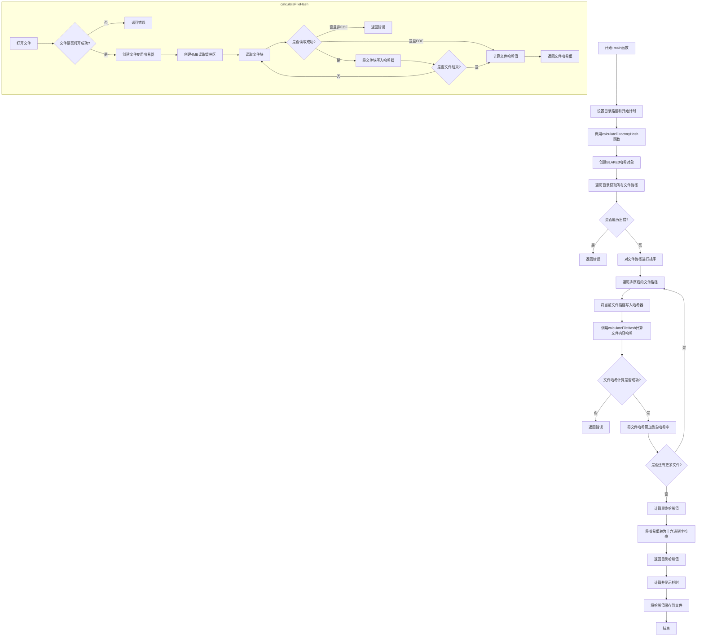

```mermaid
flowchart TD
    A[开始: main函数] --> B[设置目录路径和开始计时]
    B --> C[调用calculateDirectoryHash函数]
    
    C --> D[创建BLAKE3哈希对象]
    D --> E[遍历目录获取所有文件路径]
    
    E --> F{是否遍历出错?}
    F -->|是| G[返回错误]
    F -->|否| H[对文件路径进行排序]
    
    H --> I[遍历排序后的文件路径]
    I --> J[将当前文件路径写入哈希器]
    J --> K[调用calculateFileHash计算文件内容哈希]
    
    K --> L{文件哈希计算是否成功?}
    L -->|否| M[返回错误]
    L -->|是| N[将文件哈希累加到总哈希中]
    
    N --> O{是否还有更多文件?}
    O -->|是| I
    O -->|否| P[计算最终哈希值]
    
    P --> Q[将哈希值转为十六进制字符串]
    Q --> R[返回目录哈希值]
    
    R --> S[计算并显示耗时]
    S --> T[将哈希值保存到文件]
    T --> U[结束]
    
    %% 文件哈希计算子流程
    subgraph calculateFileHash
        K1[打开文件] --> K2{文件是否打开成功?}
        K2 -->|否| K3[返回错误]
        K2 -->|是| K4[创建文件专用哈希器]
        
        K4 --> K5[创建4MB读取缓冲区]
        K5 --> K6[读取文件块]
        
        K6 --> K7{是否读取成功?}
        K7 -->|否且非EOF| K8[返回错误]
        K7 -->|是| K9[将文件块写入哈希器]
        K9 --> K10{是否文件结束?}
        K10 -->|否| K6
        
        K7 -->|是且EOF| K11[计算文件哈希值]
        K10 -->|是| K11
        
        K11 --> K12[返回文件哈希值]
    end
```