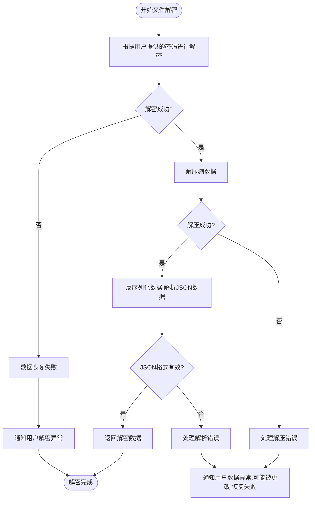

```mermaid


flowchart TD
    Start([开始文件解密]) --> ReadFile[根据用户提供的密码进行解密]
    ReadFile --> DecryptionSuccess{解密成功?}
    
    DecryptionSuccess -->|否| A[数据恢复失败]
    DecryptionSuccess -->|是| DecompressData[解压缩数据]
    
    DecompressData --> DecompressionSuccess{解压成功?}
    DecompressionSuccess -->|否| HandleDecompressError[处理解压错误]
    DecompressionSuccess -->|是| ParseJSON[反序列化数据,解析JSON数据]
    
    ParseJSON --> JSONValid{JSON格式有效?}
    JSONValid -->|否| HandleParseError[处理解析错误]
    JSONValid -->|是| ReturnDecryptedData[返回解密数据]
    
    ReturnDecryptedData --> End([解密完成])
    
    HandleDecompressError --> LogError[通知用户数据异常,可能被更改,恢复失败]
    HandleParseError --> LogError
    
    A --> ThrowException[通知用户解密异常]
    ThrowException --> End

```