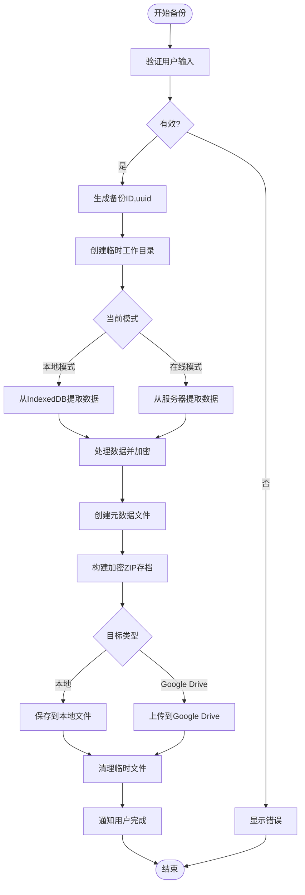

```mermaid


flowchart TD
    Start([开始备份]) --> ValidateInput[验证用户输入]
    ValidateInput --> InputValid{有效?}
    InputValid -->|否| ShowError[显示错误]
    InputValid -->|是| GenerateBackupID[生成备份ID,uuid]
    
    GenerateBackupID --> CreateTemp[创建临时工作目录]
    
    CreateTemp --> CheckMode{当前模式}
    CheckMode -->|本地模式| ExtractFromIndexedDB[从IndexedDB提取数据]
    CheckMode -->|在线模式| ExtractFromServer[从服务器提取数据]
    
    ExtractFromIndexedDB --> ProcessData[处理数据并加密]
    ExtractFromServer --> ProcessData
    
    ProcessData --> CreateMetadata[创建元数据文件]
    CreateMetadata --> BuildArchive[构建加密ZIP存档]
    
    BuildArchive --> DestinationType{目标类型}
    DestinationType -->|本地| SaveToLocal[保存到本地文件]
    DestinationType -->|Google Drive| UploadToGDrive[上传到Google Drive]
    
    SaveToLocal --> CleanupTemp[清理临时文件]
    UploadToGDrive --> CleanupTemp
    
    CleanupTemp --> NotifyUser[通知用户完成]
    NotifyUser --> End([结束])
    
    ShowError --> End

```