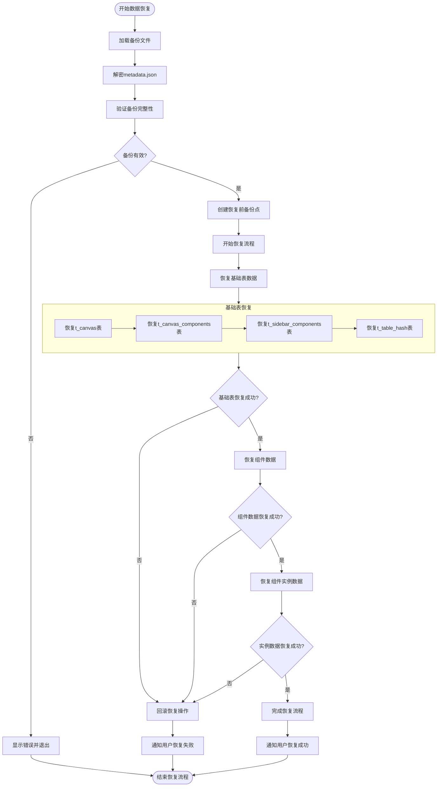

```mermaid

flowchart TD
    Start([开始数据恢复]) --> LoadBackup[加载备份文件]
    LoadBackup --> DecryptMetadata[解密metadata.json]
    DecryptMetadata --> VerifyBackup[验证备份完整性]
    
    VerifyBackup --> BackupValid{备份有效?}
    BackupValid -->|否| ShowError[显示错误并退出]
    BackupValid -->|是| CreateRestorePoint[创建恢复前备份点]
    
    CreateRestorePoint --> BeginRestoreProcess[开始恢复流程]
    BeginRestoreProcess --> RestoreBasicTables[恢复基础表数据]
    
    subgraph BasicTableRestore [基础表恢复]
        B1[恢复t_canvas表] --> B2[恢复t_canvas_components表]
        B2 --> B3[恢复t_sidebar_components表]
        B3 --> B4[恢复t_table_hash表]
    end
    
    RestoreBasicTables --> BasicTableRestore
    
    BasicTableRestore --> BasicTablesComplete{基础表恢复成功?}
    BasicTablesComplete -->|否| RollbackRestore[回滚恢复操作]
    BasicTablesComplete -->|是| RestoreComponentData[恢复组件数据]
    
    RestoreComponentData --> ComponentDataComplete{组件数据恢复成功?}
    ComponentDataComplete -->|否| RollbackRestore
    ComponentDataComplete -->|是| RestoreInstanceData[恢复组件实例数据]
    
    RestoreInstanceData --> InstanceDataComplete{实例数据恢复成功?}
    InstanceDataComplete -->|否| RollbackRestore
    InstanceDataComplete -->|是| FinalizeRestore[完成恢复流程]
    
    FinalizeRestore --> NotifySuccess[通知用户恢复成功]
    RollbackRestore --> NotifyFailure[通知用户恢复失败]
    
    NotifySuccess --> End([结束恢复流程])
    NotifyFailure --> End
    ShowError --> End

```