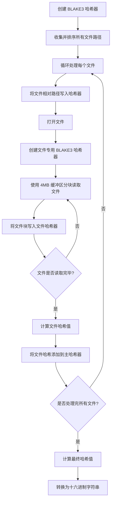

```mermaid
flowchart TD
    A[创建 BLAKE3 哈希器] --> B[收集并排序所有文件路径]
    B --> C[循环处理每个文件]
    
    C --> D[将文件相对路径写入哈希器]
    D --> E[打开文件]
    E --> F[创建文件专用 BLAKE3 哈希器]
    
    F --> G[使用 4MB 缓冲区分块读取文件]
    G --> H[将文件块写入文件哈希器]
    H --> I{文件是否读取完毕?}
    
    I -->|否| G
    I -->|是| J[计算文件哈希值]
    
    J --> K[将文件哈希添加到主哈希器]
    K --> L{是否处理完所有文件?}
    
    L -->|否| C
    L -->|是| M[计算最终哈希值]
    
    M --> N[转换为十六进制字符串]
```