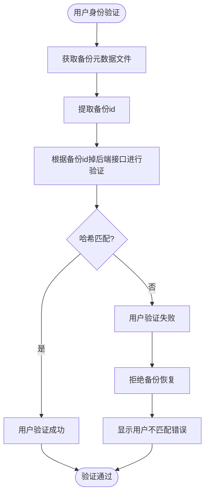

```mermaid

flowchart TD
    Start([用户身份验证]) --> DecryptMetadata[获取备份元数据文件]
    DecryptMetadata --> ExtractUserHash[提取备份id]
    ExtractUserHash --> GetCurrentUser[根据备份id掉后端接口进行验证]
    
    GetCurrentUser -->  HashMatch{哈希匹配?}
    HashMatch -->|是| VerifySuccess[用户验证成功]
    HashMatch -->|否| VerifyFailure[用户验证失败]
    
    VerifySuccess --> End([验证通过])
    VerifyFailure --> RejectBackup[拒绝备份恢复]
    RejectBackup --> ShowUserError[显示用户不匹配错误]
    
    ShowUserError --> End

```