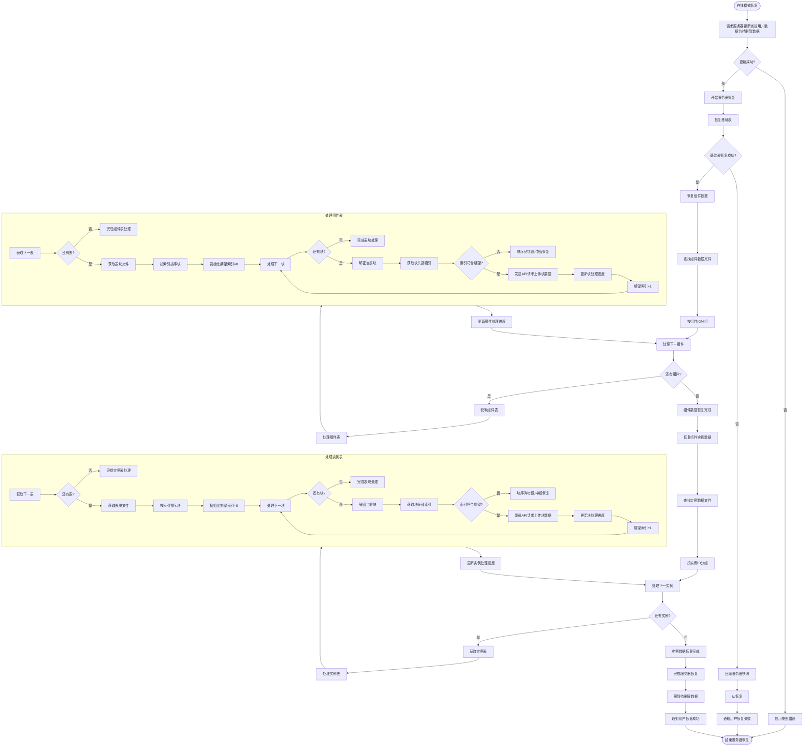

```mermaid

flowchart TD
    Start([在线模式恢复]) --> RequestSnapshot[请求服务器更新当前用户数据为待删除数据]


    RequestSnapshot --> SnapshotCreated{更新成功?}
    SnapshotCreated -->|否| ShowSnapshotError[显示快照错误]
    SnapshotCreated -->|是| BeginServerRestore[开始服务器恢复]
    
    BeginServerRestore --> RestoreBasicTables[恢复基础表]
    
    RestoreBasicTables --> BasicTablesComplete{基础表恢复成功?}
    BasicTablesComplete -->|否| RollbackServerRestore[回滚服务器快照]
    BasicTablesComplete -->|是| RestoreComponentData[恢复组件数据]
    
    RestoreComponentData --> FindComponentFiles[查找组件数据文件]
    FindComponentFiles --> GroupByComponent[按组件ID分组]
    
    GroupByComponent --> ProcessNextComp[处理下一组件]
    ProcessNextComp --> MoreComps{还有组件?}
    
    MoreComps -->|否| CompDataComplete[组件数据恢复完成]
    MoreComps -->|是| GetCompTables[获取组件表]
    
    GetCompTables --> ProcessCompTables[处理组件表]
    
    subgraph ProcessCompTable [处理组件表]
        CT1[获取下一表] --> CT2{还有表?}
        CT2 -->|否| CT16[完成组件表处理]
        CT2 -->|是| CT3[获取表块文件]
        CT3 --> CT4[按索引排序块]
        CT4 --> CT5[初始化期望索引=0]
        CT5 --> CT6[处理下一块]
        CT6 --> CT7{还有块?}
        CT7 -->|否| CT15[完成表块处理]
        CT7 -->|是| CT8[解密当前块]
        CT8 --> CT9[获取块头部索引]
        CT9 --> CT10{索引符合期望?}
        CT10 -->|否| CT14[块序列错误,中断恢复]
        CT10 -->|是| CT11[发送API请求上传块数据]
        CT11 --> CT12[更新块处理进度]
        CT12 --> CT13[期望索引+1]
        CT13 --> CT6
    end
    
    ProcessCompTables --> ProcessCompTable
    
    ProcessCompTable --> UpdateCompProgress[更新组件处理进度]
    UpdateCompProgress --> ProcessNextComp
    
    CompDataComplete --> RestoreInstanceData[恢复组件实例数据]
    
    RestoreInstanceData --> FindInstanceFiles[查找实例数据文件]
    FindInstanceFiles --> GroupByInstance[按实例ID分组]
    
    GroupByInstance --> ProcessNextInst[处理下一实例]
    ProcessNextInst --> MoreInsts{还有实例?}
    
    MoreInsts -->|否| InstDataComplete[实例数据恢复完成]
    MoreInsts -->|是| GetInstTables[获取实例表]
    
    GetInstTables --> ProcessInstTables[处理实例表]
    
    subgraph ProcessInstTable [处理实例表]
        IT1[获取下一表] --> IT2{还有表?}
        IT2 -->|否| IT16[完成实例表处理]
        IT2 -->|是| IT3[获取表块文件]
        IT3 --> IT4[按索引排序块]
        IT4 --> IT5[初始化期望索引=0]
        IT5 --> IT6[处理下一块]
        IT6 --> IT7{还有块?}
        IT7 -->|否| IT15[完成表块处理]
        IT7 -->|是| IT8[解密当前块]
        IT8 --> IT9[获取块头部索引]
        IT9 --> IT10{索引符合期望?}
        IT10 -->|否| IT14[块序列错误,中断恢复]
        IT10 -->|是| IT11[发送API请求上传块数据]
        IT11 --> IT12[更新块处理进度]
        IT12 --> IT13[期望索引+1]
        IT13 --> IT6
    end
    
    ProcessInstTables --> ProcessInstTable
    
    ProcessInstTable --> UpdateInstProgress[更新实例处理进度]
    UpdateInstProgress --> ProcessNextInst
    
    InstDataComplete --> FinalizeServerRestore[完成服务器恢复]
    FinalizeServerRestore --> DeleteServerSnapshot[删除待删除数据]
    DeleteServerSnapshot --> NotifySuccess[通知用户恢复成功]
    
    RollbackServerRestore --> RestoreFromSnapshot[从恢复]
    RestoreFromSnapshot --> NotifyFailure[通知用户恢复失败]
    
    NotifySuccess --> End([结束服务器恢复])
    NotifyFailure --> End
    ShowSnapshotError --> End

```