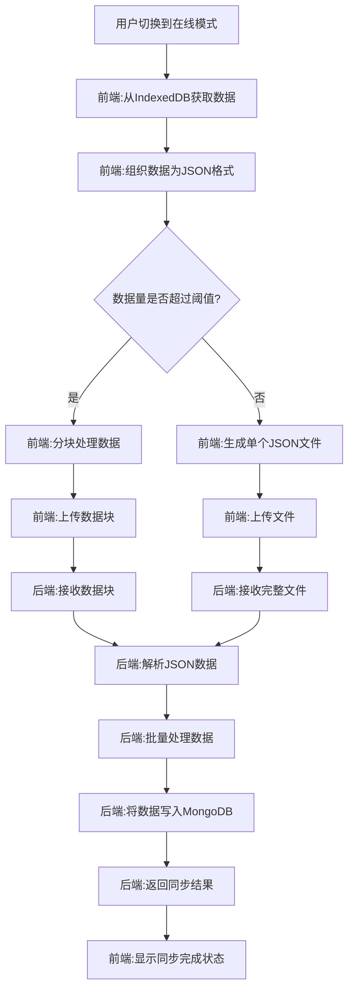

```mermaid

flowchart TD
    A[用户切换到在线模式] --> B[前端:从IndexedDB获取数据]
    B --> C[前端:组织数据为JSON格式]
    C --> D{数据量是否超过阈值?}
    D -->|是| E[前端:分块处理数据]
    D -->|否| F[前端:生成单个JSON文件]
    E --> G[前端:上传数据块]
    F --> H[前端:上传文件]
    G --> I[后端:接收数据块]
    H --> J[后端:接收完整文件]
    I --> K[后端:解析JSON数据]
    J --> K
    K --> L[后端:批量处理数据]
    L --> M[后端:将数据写入MongoDB]
    M --> N[后端:返回同步结果]
    N --> O[前端:显示同步完成状态]


```