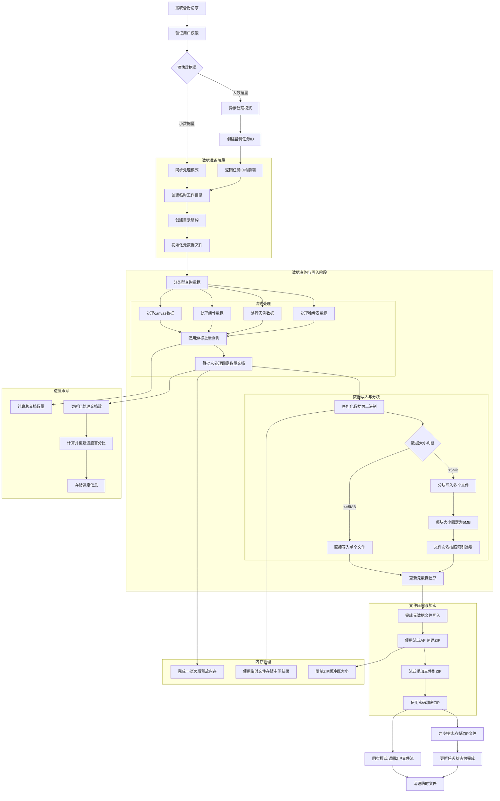

```mermaid
flowchart TD
    A[接收备份请求] --> B[验证用户权限]
    B --> C{预估数据量}
    C -->|小数据量| D[同步处理模式]
    C -->|大数据量| E[异步处理模式]
    
    E --> F[创建备份任务ID]
    F --> G[返回任务ID给前端]
    
    subgraph 数据准备阶段
      D --> H[创建临时工作目录]
      G --> H
      H --> I[创建目录结构]
      I --> J[初始化元数据文件]
    end
    
    subgraph 数据查询与写入阶段
      J --> K[分类型查询数据]
      
      K --> L[处理canvas数据]
      K --> M[处理组件数据]
      K --> N[处理实例数据]
      K --> O[处理哈希表数据]
      
      subgraph 流式处理
        L --> P[使用游标批量查询]
        M --> P
        N --> P
        O --> P
        P --> Q[每批次处理固定数量文档]
      end
      
      subgraph 数据写入与分块
        Q --> R[序列化数据为二进制]
        R --> S{数据大小判断}
        S -->|<=5MB| T[直接写入单个文件]
        S -->|>5MB| U[分块写入多个文件]
        
        U --> V[每块大小固定为5MB]
        V --> W[文件命名按照索引递增]
      end
      
      T --> X[更新元数据信息]
      W --> X
    end
    
    subgraph 文件压缩与加密
      X --> Y[完成元数据文件写入]
      Y --> Z[使用流式API创建ZIP]
      Z --> AA[流式添加文件到ZIP]
      AA --> AB[使用密码加密ZIP]
    end
    
    subgraph 内存管理
      Q --> AC[完成一批次后释放内存]
      R --> AD[使用临时文件存储中间结果]
      Z --> AE[限制ZIP缓冲区大小]
    end
    
    subgraph 进度跟踪
      P --> AF[计算总文档数量]
      Q --> AG[更新已处理文档数]
      AG --> AH[计算并更新进度百分比]
      AH --> AI[存储进度信息]
    end
    
    AB --> AJ[异步模式:存储ZIP文件]
    AB --> AK[同步模式:返回ZIP文件流]
    
    AJ --> AL[更新任务状态为完成]
    AK --> AM[清理临时文件]
    AL --> AM
```