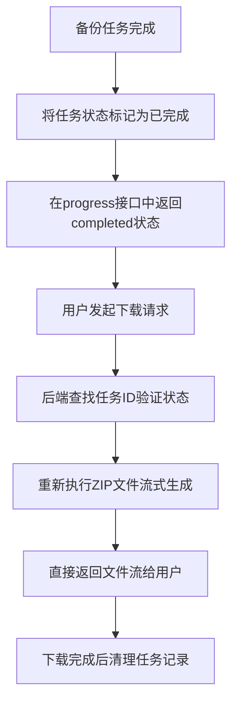

```mermaid
flowchart TD
    A[备份任务完成] --> B[将任务状态标记为已完成]
    B --> C[在progress接口中返回completed状态]
    C --> D[用户发起下载请求]
    D --> E[后端查找任务ID验证状态]
    E --> F[重新执行ZIP文件流式生成]
    F --> G[直接返回文件流给用户]
    G --> H[下载完成后清理任务记录]
```