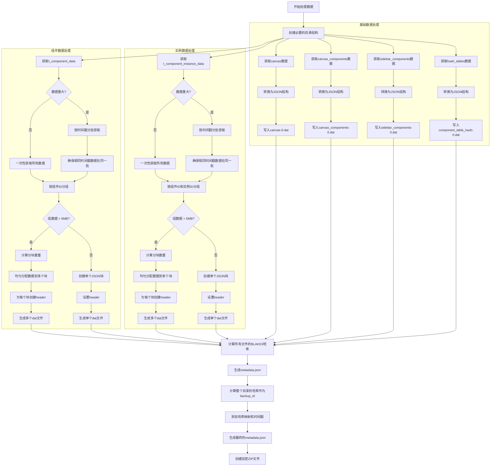

```mermaid
flowchart TD
    A[开始处理数据] --> B[创建必要的目录结构]
    
    subgraph 基础数据处理
        B --> C1[获取canvas数据]
        C1 --> D1[转换为JSON结构]
        D1 --> E1[写入canvas-0.dat]
        
        B --> C2[获取canvas_components数据]
        C2 --> D2[转换为JSON结构]
        D2 --> E2[写入canvas_components-0.dat]
        
        B --> C3[获取sidebar_components数据]
        C3 --> D3[转换为JSON结构]
        D3 --> E3[写入sidebar_components-0.dat]
        
        B --> C4[获取hash_tables数据]
        C4 --> D4[转换为JSON结构]
        D4 --> E4[写入component_table_hash-0.dat]
    end
    
    subgraph 组件数据处理
        B --> F[获取t_component_data]
        F --> G{数据量大?}
        
        G -->|否| H1[一次性获取所有数据]
        G -->|是| H2[按时间戳分批获取]
        H2 --> I[确保相同时间戳数据在同一批]
        
        H1 --> J[按组件ID分组]
        I --> J
        
        J --> K{组数据 > 5MB?}
        K -->|是| L1[计算分块数量]
        L1 --> M1[均匀分配数据到多个块]
        M1 --> N1[为每个块创建header]
        N1 --> O1[生成多个dat文件]
        
        K -->|否| L2[创建单个JSON块]
        L2 --> M2[设置header]
        M2 --> N2[生成单个dat文件]
    end
    
    subgraph 实例数据处理
        B --> P[获取t_component_instance_data]
        P --> Q{数据量大?}
        
        Q -->|否| R1[一次性获取所有数据]
        Q -->|是| R2[按时间戳分批获取]
        R2 --> S[确保相同时间戳数据在同一批]
        
        R1 --> T[按组件ID和实例ID分组]
        S --> T
        
        T --> U{组数据 > 5MB?}
        U -->|是| V1[计算分块数量]
        V1 --> W1[均匀分配数据到多个块]
        W1 --> X1[为每个块创建header]
        X1 --> Y1[生成多个dat文件]
        
        U -->|否| V2[创建单个JSON块]
        V2 --> W2[设置header]
        W2 --> X2[生成单个dat文件]
    end
    
    O1 --> Z[计算所有文件的BLAKE3哈希]
    N2 --> Z
    Y1 --> Z
    X2 --> Z
    E1 --> Z
    E2 --> Z
    E3 --> Z
    E4 --> Z
    
    Z --> AA[生成metadata.json]
    AA --> AB[计算整个目录的哈希作为backup_id]
    AB --> AC[添加哈希映射和时间戳]
    AC --> AD[生成最终的metadata.json]
    
    AD --> AE[创建加密ZIP文件]
```