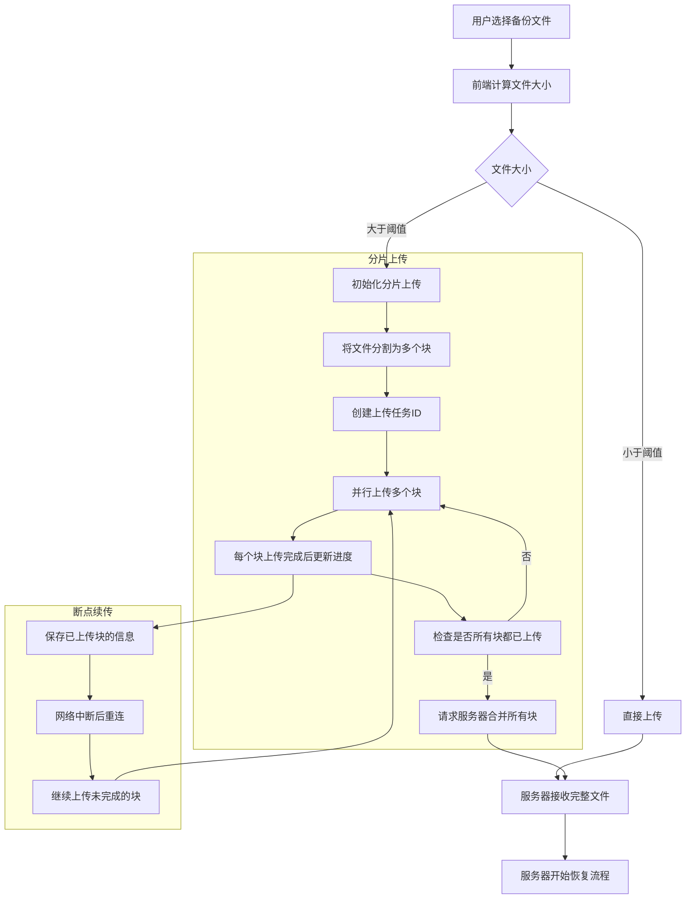

```mermaid
flowchart TD
    A[用户选择备份文件] --> B[前端计算文件大小]
    B --> C{文件大小}
    C -->|小于阈值| D[直接上传]
    C -->|大于阈值| E[初始化分片上传]
    
    subgraph 分片上传
      E --> F[将文件分割为多个块]
      F --> G[创建上传任务ID]
      G --> H[并行上传多个块]
      H --> I[每个块上传完成后更新进度]
      I --> J[检查是否所有块都已上传]
      J -->|否| H
      J -->|是| K[请求服务器合并所有块]
    end
    
    D --> L[服务器接收完整文件]
    K --> L
    L --> M[服务器开始恢复流程]
    
    subgraph 断点续传
      I --> N[保存已上传块的信息]
      N --> O[网络中断后重连]
      O --> P[继续上传未完成的块]
      P --> H
    end
```