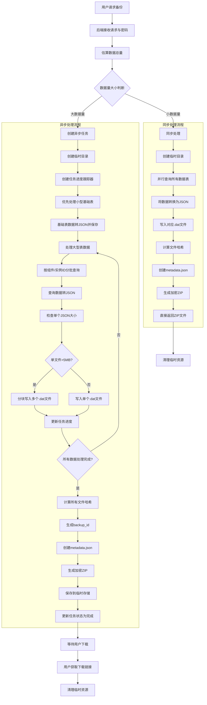

```mermaid
flowchart TD
    A[用户请求备份] --> B[后端接收请求与密码]
    B --> C[估算数据总量]
    C --> D{数据量大小判断}
    
    D -->|小数据量| E[同步处理]
    D -->|大数据量| F[创建异步任务]
    
    subgraph 同步处理流程
        E --> G1[创建临时目录]
        G1 --> H1[并行查询所有数据表]
        H1 --> I1[将数据转换为JSON]
        I1 --> J1[写入对应.dat文件]
        J1 --> K1[计算文件哈希]
        K1 --> L1[创建metadata.json]
        L1 --> M1[生成加密ZIP]
        M1 --> N1[直接返回ZIP文件]
    end
    
    subgraph 异步处理流程
        F --> G2[创建临时目录]
        G2 --> H2[创建任务进度跟踪器]
        H2 --> I2[优先处理小型基础表]
        
        I2 --> J2[基础表数据转JSON并保存]
        
        J2 --> K2[处理大型表数据]
        K2 --> L2[按组件/实例ID分批查询]
        L2 --> M2[查询数据转JSON]
        M2 --> N2[检查单个JSON大小]
        
        N2 --> O2{单文件>5MB?}
        O2 -->|是| P2[分块写入多个.dat文件]
        O2 -->|否| Q2[写入单个.dat文件]
        
        P2 --> R2[更新任务进度]
        Q2 --> R2
        
        R2 --> S2{所有数据处理完成?}
        S2 -->|否| K2
        S2 -->|是| T2[计算所有文件哈希]
        
        T2 --> U2[生成backup_id]
        U2 --> V2[创建metadata.json]
        V2 --> W2[生成加密ZIP]
        W2 --> X2[保存到临时存储]
        X2 --> Y2[更新任务状态为完成]
    end
    
    N1 --> Z1[清理临时资源]
    Y2 --> Z2[等待用户下载]
    Z2 --> AA[用户获取下载链接]
    AA --> AB[清理临时资源]
```