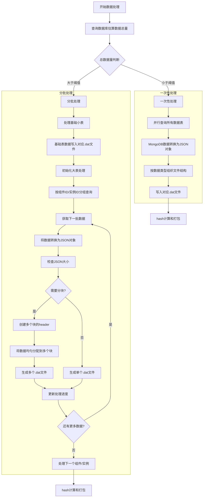

```mermaid
flowchart TD
    A[开始数据处理] --> B[查询数据库估算数据总量]
    B --> C{总数据量判断}
    
    C -->|小于阈值| D[一次性处理]
    C -->|大于阈值| E[分批处理]
    
    subgraph 一次性处理
        D --> F1[并行查询所有数据表]
        F1 --> G1[MongoDB数据转换为JSON对象]
        G1 --> H1[按数据类型组织文件结构]
        H1 --> I1[写入对应.dat文件]
    end
    
    subgraph 分批处理
        E --> F2[处理基础小表]
        F2 --> G2[基础表数据写入对应.dat文件]
        
        G2 --> H2[初始化大表处理]
        H2 --> I2[按组件ID/实例ID分组查询]
        I2 --> J2[获取下一批数据]
        J2 --> K2[将数据转换为JSON对象]
        K2 --> L2[检查JSON大小]
        
        L2 --> M2{需要分块?}
        M2 -->|是| N2[创建多个块的header]
        N2 --> O2[将数据均匀分配到多个块]
        O2 --> P2[生成多个.dat文件]
        
        M2 -->|否| Q2[生成单个.dat文件]
        
        P2 --> R2[更新处理进度]
        Q2 --> R2
        
        R2 --> S2{还有更多数据?}
        S2 -->|是| J2
        S2 -->|否| T2[处理下一个组件/实例]
    end
    
    I1 --> U1[hash计算和打包]
    T2 --> U2[hash计算和打包]
```