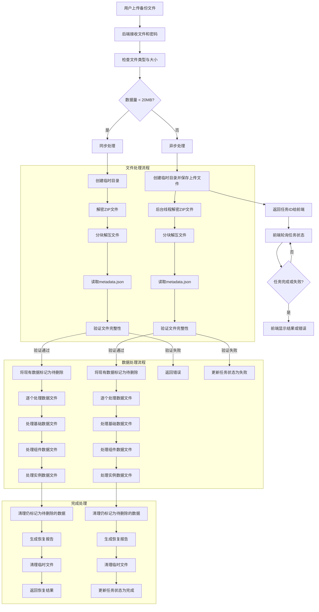

```mermaid
flowchart TD
    A[用户上传备份文件] --> B[后端接收文件和密码]
    B --> C[检查文件类型与大小]
    
    C --> D{数据量 < 20MB?}
    
    D -->|是| E1[同步处理]
    D -->|否| E2[异步处理]
    
    E1 --> F1[创建临时目录]
    E2 --> F2[创建临时目录并保存上传文件]
    F2 --> G2[返回任务ID给前端]
    
    subgraph 文件处理流程
        F1 --> H1[解密ZIP文件]
        F2 --> H2[后台线程解密ZIP文件]
        
        H1 --> I1[分块解压文件]
        H2 --> I2[分块解压文件]
        
        I1 --> J1[读取metadata.json]
        I2 --> J2[读取metadata.json]
        
        J1 --> K1[验证文件完整性]
        J2 --> K2[验证文件完整性]
    end
    
    subgraph 数据处理流程
        K1 -->|验证通过| L1[将现有数据标记为待删除]
        K2 -->|验证通过| L2[将现有数据标记为待删除]
        
        K1 -->|验证失败| Z1[返回错误]
        K2 -->|验证失败| Z2[更新任务状态为失败]
        
        L1 --> M1[逐个处理数据文件]
        L2 --> M2[逐个处理数据文件]
        
        M1 --> N1[处理基础数据文件]
        M2 --> N2[处理基础数据文件]
        
        N1 --> O1[处理组件数据文件]
        N2 --> O2[处理组件数据文件]
        
        O1 --> P1[处理实例数据文件]
        O2 --> P2[处理实例数据文件]
    end
    
    subgraph 完成处理
        P1 --> Q1[清理仍标记为待删除的数据]
        P2 --> Q2[清理仍标记为待删除的数据]
        
        Q1 --> R1[生成恢复报告]
        Q2 --> R2[生成恢复报告]
        
        R1 --> S1[清理临时文件]
        R2 --> S2[清理临时文件]
        
        S1 --> T1[返回恢复结果]
        S2 --> T2[更新任务状态为完成]
    end
    
    G2 --> U[前端轮询任务状态]
    U --> V{任务完成或失败?}
    V -->|否| U
    V -->|是| W[前端显示结果或错误]
```