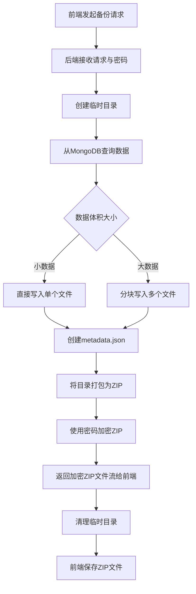

```mermaid
flowchart TD
    A[前端发起备份请求] --> B[后端接收请求与密码]
    B --> C[创建临时目录]
    C --> D[从MongoDB查询数据]
    D --> E{数据体积大小}
    E -->|小数据| F[直接写入单个文件]
    E -->|大数据| G[分块写入多个文件]
    F --> H[创建metadata.json]
    G --> H
    H --> I[将目录打包为ZIP]
    I --> J[使用密码加密ZIP]
    J --> K[返回加密ZIP文件流给前端]
    K --> L[清理临时目录]
    L --> M[前端保存ZIP文件]
```