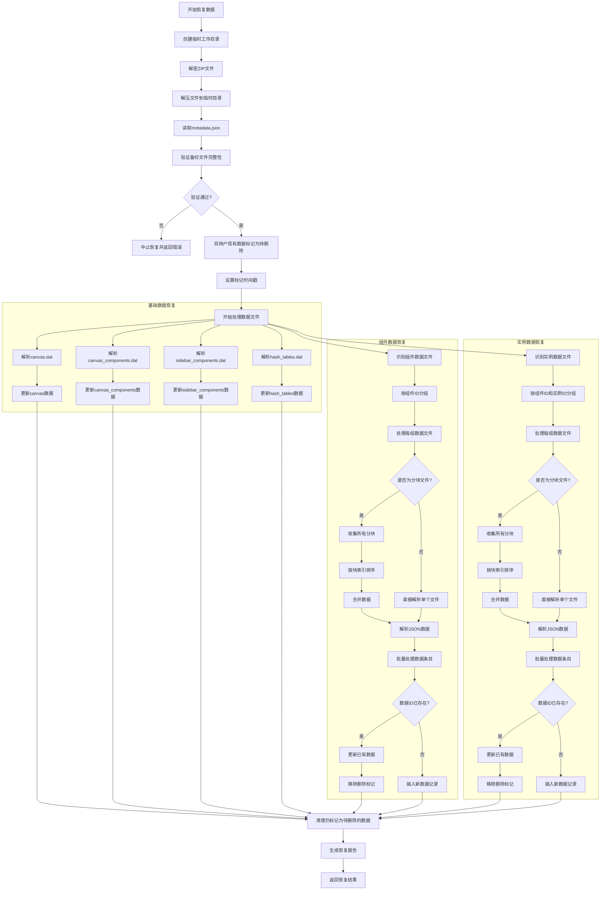

```mermaid
flowchart TD
    A[开始恢复数据] --> B[创建临时工作目录]
    B --> C[解密ZIP文件]
    C --> D[解压文件到临时目录]
    
    D --> E[读取metadata.json]
    E --> F[验证备份文件完整性]
    F --> G{验证通过?}
    G -->|否| H[中止恢复并返回错误]
    
    G -->|是| I[将用户现有数据标记为待删除]
    I --> J[设置标记时间戳]
    
    J --> K[开始处理数据文件]
    
    subgraph 基础数据恢复
        K --> L1[解析canvas.dat]
        L1 --> M1[更新canvas数据]
        
        K --> L2[解析canvas_components.dat]
        L2 --> M2[更新canvas_components数据]
        
        K --> L3[解析sidebar_components.dat]
        L3 --> M3[更新sidebar_components数据]
        
        K --> L4[解析hash_tables.dat]
        L4 --> M4[更新hash_tables数据]
    end
    
    subgraph 组件数据恢复
        K --> N[识别组件数据文件]
        N --> O[按组件ID分组]
        O --> P[处理每组数据文件]
        
        P --> Q{是否为分块文件?}
        Q -->|是| R1[收集所有分块]
        R1 --> S1[按块索引排序]
        S1 --> T1[合并数据]
        T1 --> U1[解析JSON数据]
        
        Q -->|否| R2[直接解析单个文件]
        R2 --> U1
        
        U1 --> V[批量处理数据条目]
        V --> W{数据ID已存在?}
        W -->|是| X1[更新已有数据]
        X1 --> Y1[移除删除标记]
        W -->|否| X2[插入新数据记录]
    end
    
    subgraph 实例数据恢复
        K --> Z[识别实例数据文件]
        Z --> AA[按组件ID和实例ID分组]
        AA --> AB[处理每组数据文件]
        
        AB --> AC{是否为分块文件?}
        AC -->|是| AD1[收集所有分块]
        AD1 --> AE1[按块索引排序]
        AE1 --> AF1[合并数据]
        AF1 --> AG1[解析JSON数据]
        
        AC -->|否| AD2[直接解析单个文件]
        AD2 --> AG1
        
        AG1 --> AH[批量处理数据条目]
        AH --> AI{数据ID已存在?}
        AI -->|是| AJ1[更新已有数据]
        AJ1 --> AK1[移除删除标记]
        AI -->|否| AJ2[插入新数据记录]
    end
    
    M1 --> AL[清理仍标记为待删除的数据]
    M2 --> AL
    M3 --> AL
    M4 --> AL
    Y1 --> AL
    X2 --> AL
    AK1 --> AL
    AJ2 --> AL
    
    AL --> AM[生成恢复报告]
    AM --> AN[返回恢复结果]
```