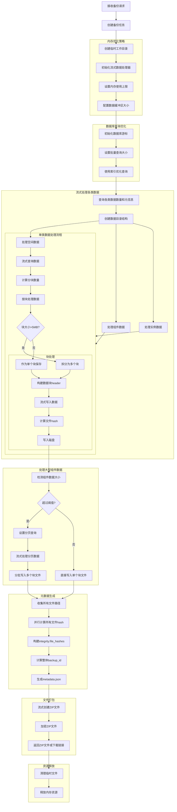

```mermaid
flowchart TD
    A[接收备份请求] --> B[创建备份任务]
    B --> C[创建临时工作目录]
    
    subgraph 内存优化策略
        C --> D[初始化流式数据处理器]
        D --> E[设置内存使用上限]
        E --> F[配置数据缓冲区大小]
    end
    
    subgraph 数据库查询优化
        F --> G[初始化数据库游标]
        G --> H[设置批量查询大小]
        H --> I[使用索引优化查询]
    end
    
    subgraph 流式处理各类数据
        I --> J[查询各类数据数量和元信息]
        J --> K[创建数据目录结构]
        
        K --> L1[处理空间数据]
        K --> L2[处理组件数据]
        K --> L3[处理实例数据]
        
        subgraph 单类数据处理流程
            L1 --> M1[流式查询数据]
            M1 --> N1[计算分块数量]
            N1 --> O1[按块处理数据]
            
            O1 --> P1{块大小>5MB?}
            P1 -->|是| Q1[拆分为多个块]
            P1 -->|否| R1[作为单个块保存]
            
            subgraph 块处理
                Q1 --> S1[构建数据块header]
                R1 --> S1
                S1 --> T1[流式写入数据]
                T1 --> U1[计算文件hash]
                U1 --> V1[写入磁盘]
            end
        end
        
        L2 --> 单类数据处理流程
        L3 --> 单类数据处理流程
    end
    
    subgraph 处理大型组件数据
        V1 --> W[检测组件数据大小]
        W --> X{超过阈值?}
        X -->|是| Y[设置分页查询]
        Y --> Z[流式处理分页数据]
        Z --> AA[分批写入多个块文件]
        X -->|否| AB[直接写入单个块文件]
    end
    
    subgraph 元数据生成
        AA --> AC[收集所有文件路径]
        AB --> AC
        AC --> AD[并行计算所有文件hash]
        AD --> AE[构建integrity.file_hashes]
        AE --> AF[计算整体backup_id]
        AF --> AG[生成metadata.json]
    end
    
    subgraph 文件打包
        AG --> AH[流式创建ZIP文件]
        AH --> AI[加密ZIP文件]
        AI --> AJ[返回ZIP文件或下载链接]
    end
    
    subgraph 资源释放
        AJ --> AK[清理临时文件]
        AK --> AL[释放内存资源]
    end
```