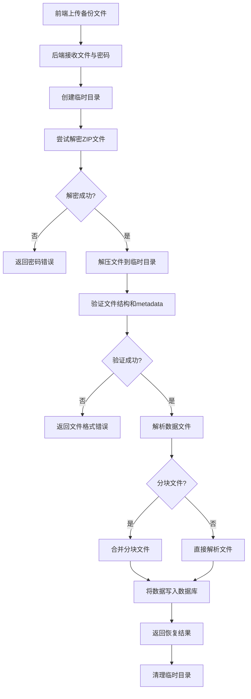

```mermaid
flowchart TD
    A[前端上传备份文件] --> B[后端接收文件与密码]
    B --> C[创建临时目录]
    C --> D[尝试解密ZIP文件]
    D --> E{解密成功?}
    E -->|否| F[返回密码错误]
    E -->|是| G[解压文件到临时目录]
    G --> H[验证文件结构和metadata]
    H --> I{验证成功?}
    I -->|否| J[返回文件格式错误]
    I -->|是| K[解析数据文件]
    K --> L{分块文件?}
    L -->|是| M[合并分块文件]
    L -->|否| N[直接解析文件]
    M --> O[将数据写入数据库]
    N --> O
    O --> P[返回恢复结果]
    P --> Q[清理临时目录]
```