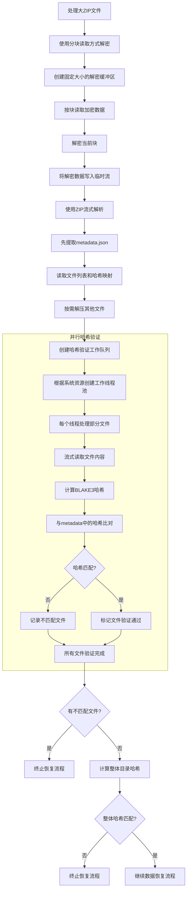

```mermaid
flowchart TD
    A[处理大ZIP文件] --> B[使用分块读取方式解密]
    
    B --> C[创建固定大小的解密缓冲区]
    C --> D[按块读取加密数据]
    D --> E[解密当前块]
    E --> F[将解密数据写入临时流]
    
    F --> G[使用ZIP流式解析]
    G --> H[先提取metadata.json]
    H --> I[读取文件列表和哈希映射]
    
    I --> J[按需解压其他文件]
    J --> K[创建哈希验证工作队列]
    
    subgraph 并行哈希验证
        K --> L[根据系统资源创建工作线程池]
        L --> M[每个线程处理部分文件]
        
        M --> N[流式读取文件内容]
        N --> O[计算BLAKE3哈希]
        O --> P[与metadata中的哈希比对]
        
        P --> Q{哈希匹配?}
        Q -->|否| R[记录不匹配文件]
        Q -->|是| S[标记文件验证通过]
        
        R --> T[所有文件验证完成]
        S --> T
    end
    
    T --> U{有不匹配文件?}
    U -->|是| V[终止恢复流程]
    U -->|否| W[计算整体目录哈希]
    
    W --> X{整体哈希匹配?}
    X -->|否| Y[终止恢复流程]
    X -->|是| Z[继续数据恢复流程]
```