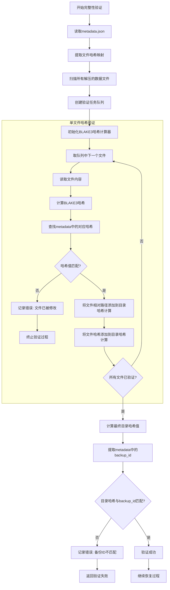

```mermaid
flowchart TD
    A[开始完整性验证] --> B[读取metadata.json]
    B --> C[提取文件哈希映射]
    
    C --> D[扫描所有解压的数据文件]
    
    D --> E[创建验证任务队列]
    E --> F[初始化BLAKE3哈希计算器]
    
    subgraph 单文件哈希验证
        F --> G[取队列中下一个文件]
        G --> H[读取文件内容]
        H --> I[计算BLAKE3哈希]
        
        I --> J[查找metadata中的对应哈希]
        J --> K{哈希值匹配?}
        
        K -->|否| L["记录错误: 文件已被修改"]
        L --> M[终止验证过程]
        
        K -->|是| N[将文件相对路径添加到目录哈希计算]
        N --> O[将文件哈希添加到目录哈希计算]
        
        O --> P{所有文件已验证?}
        P -->|否| G
    end
    
    P -->|是| Q[计算最终目录哈希值]
    Q --> R[提取metadata中的backup_id]
    
    R --> S{目录哈希与backup_id匹配?}
    S -->|否| T["记录错误: 备份ID不匹配"]
    T --> U[返回验证失败]
    
    S -->|是| V[验证成功]
    V --> W[继续恢复过程]
```