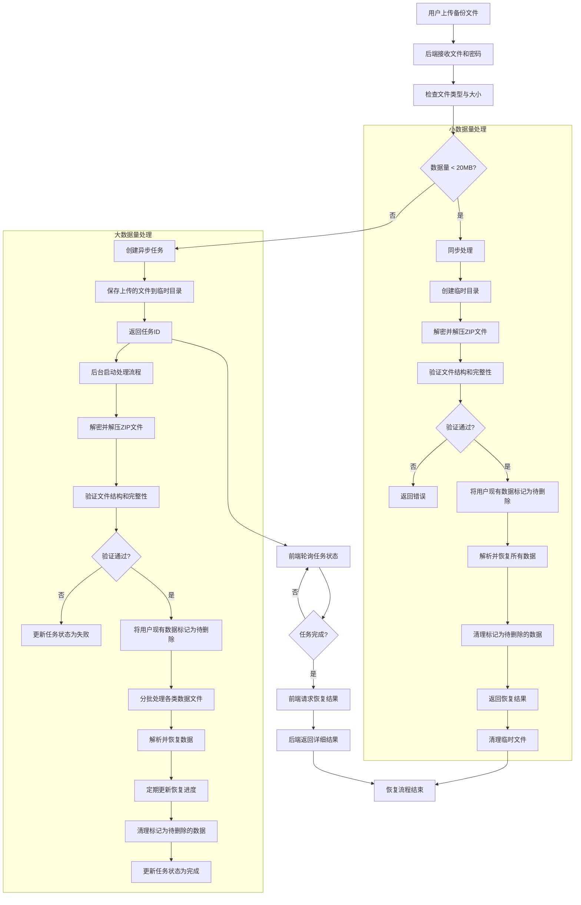

```mermaid
flowchart TD
    A[用户上传备份文件] --> B[后端接收文件和密码]
    B --> C[检查文件类型与大小]
    
    C --> D{数据量 < 20MB?}
    
    subgraph 小数据量处理
        D -->|是| E1[同步处理]
        E1 --> F1[创建临时目录]
        F1 --> G1[解密并解压ZIP文件]
        G1 --> H1[验证文件结构和完整性]
        H1 --> I1{验证通过?}
        I1 -->|否| J1[返回错误]
        I1 -->|是| K1[将用户现有数据标记为待删除]
        K1 --> L1[解析并恢复所有数据]
        L1 --> M1[清理标记为待删除的数据]
        M1 --> N1[返回恢复结果]
        N1 --> O1[清理临时文件]
    end
    
    subgraph 大数据量处理
        D -->|否| E2[创建异步任务]
        E2 --> F2[保存上传的文件到临时目录]
        F2 --> G2[返回任务ID]
        G2 --> H2[后台启动处理流程]
        
        H2 --> I2[解密并解压ZIP文件]
        I2 --> J2[验证文件结构和完整性]
        J2 --> K2{验证通过?}
        K2 -->|否| L2[更新任务状态为失败]
        K2 -->|是| M2[将用户现有数据标记为待删除]
        
        M2 --> N2[分批处理各类数据文件]
        N2 --> O2[解析并恢复数据]
        O2 --> P2[定期更新恢复进度]
        P2 --> Q2[清理标记为待删除的数据]
        Q2 --> R2[更新任务状态为完成]
    end
    
    G2 --> S[前端轮询任务状态]
    S --> T{任务完成?}
    T -->|否| S
    
    T -->|是| U[前端请求恢复结果]
    U --> V[后端返回详细结果]
    
    O1 --> W[恢复流程结束]
    V --> W
```