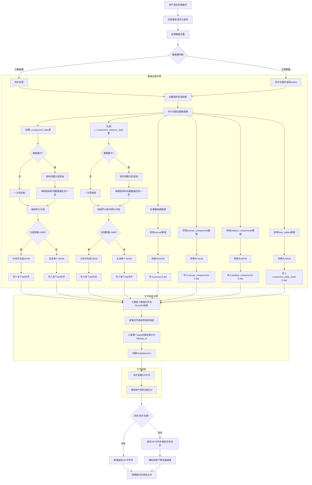

```mermaid
flowchart TD
    A[用户请求创建备份] --> B[后端接收请求与密码]
    B --> C[估算数据总量]
    C --> D{数据量判断}
    
    D -->|小数据量| E1[同步处理]
    D -->|大数据量| E2[异步处理并返回taskId]
    
    subgraph 数据处理流程
        E1 --> F[创建临时目录结构]
        E2 --> F
        
        F --> G[并行处理各类数据表]
        
        G --> H1[处理基础数据表]
        H1 --> I1[获取canvas数据]
        I1 --> J1[转换为JSON]
        J1 --> K1[写入canvas-0.dat]
        
        G --> H2[获取canvas_components数据]
        H2 --> I2[转换为JSON]
        I2 --> J2[写入canvas_components-0.dat]
        
        G --> H3[获取sidebar_components数据]
        H3 --> I3[转换为JSON]
        I3 --> J3[写入sidebar_components-0.dat]
        
        G --> H4[获取hash_tables数据]
        H4 --> I4[转换为JSON]
        I4 --> J4[写入component_table_hash-0.dat]
        
        G --> H5[处理t_component_data表]
        H5 --> I5{数据量大?}
        I5 -->|否| J5[一次性获取]
        I5 -->|是| K5[按时间戳分批查询]
        K5 --> L5[确保相同时间戳数据在同一批]
        J5 --> M5[按组件ID分组]
        L5 --> M5
        M5 --> N5{分组数据>5MB?}
        N5 -->|是| O5[分块并生成JSON]
        N5 -->|否| P5[生成单个JSON]
        O5 --> Q5[写入多个dat文件]
        P5 --> R5[写入单个dat文件]
        
        G --> H6[处理t_component_instance_data表]
        H6 --> I6{数据量大?}
        I6 -->|否| J6[一次性获取]
        I6 -->|是| K6[按时间戳分批查询]
        K6 --> L6[确保相同时间戳数据在同一批]
        J6 --> M6[按组件ID和实例ID分组]
        L6 --> M6
        M6 --> N6{分组数据>5MB?}
        N6 -->|是| O6[分块并生成JSON]
        N6 -->|否| P6[生成单个JSON]
        O6 --> Q6[写入多个dat文件]
        P6 --> R6[写入单个dat文件]
    end
    
    subgraph 文件哈希计算
        Q5 --> S[计算每个数据文件的BLAKE3哈希]
        R5 --> S
        Q6 --> S
        R6 --> S
        K1 --> S
        J2 --> S
        J3 --> S
        J4 --> S
        
        S --> T[收集文件路径和哈希映射]
        T --> U[计算整个data目录哈希作为backup_id]
        U --> V[创建metadata.json]
    end
    
    subgraph 打包加密
        V --> W[流式创建ZIP文件]
        W --> X[使用用户密码加密ZIP]
    end
    
    X --> Y{同步/异步处理?}
    Y -->|同步| Z1[直接返回ZIP文件流]
    Y -->|异步| Z2[保存ZIP文件并更新任务状态]
    Z2 --> AA[通知前端下载准备就绪]
    Z1 --> AB[清理临时目录和文件]
    AA --> AB
```