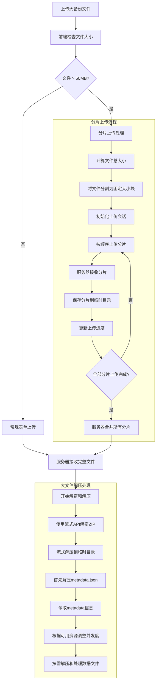

```mermaid
flowchart TD
    A[上传大备份文件] --> B[前端检查文件大小]
    B --> C{文件 > 50MB?}
    
    C -->|否| D1[常规表单上传]
    C -->|是| D2[分片上传处理]
    
    subgraph 分片上传流程
        D2 --> E[计算文件总大小]
        E --> F[将文件分割为固定大小块]
        F --> G[初始化上传会话]
        
        G --> H[按顺序上传分片]
        H --> I[服务器接收分片]
        I --> J[保存分片到临时目录]
        J --> K[更新上传进度]
        
        K --> L{全部分片上传完成?}
        L -->|否| H
        L -->|是| M[服务器合并所有分片]
    end
    
    D1 --> N[服务器接收完整文件]
    M --> N
    
    N --> O[开始解密和解压]
    
    subgraph 大文件解压处理
        O --> P[使用流式API解密ZIP]
        P --> Q[流式解压到临时目录]
        Q --> R[首先解压metadata.json]
        R --> S[读取metadata信息]
        S --> T[根据可用资源调整并发度]
        T --> U[按需解压和处理数据文件]
    end
```