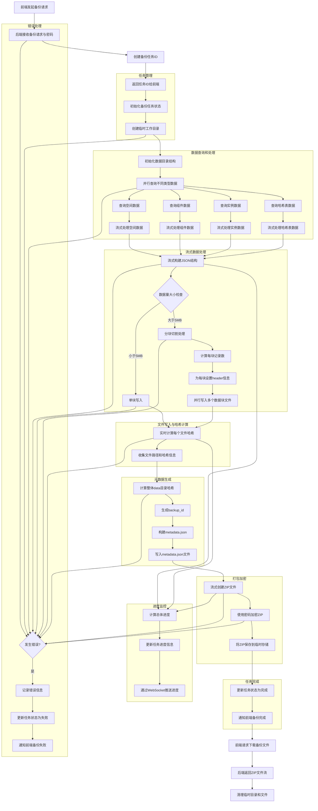

```mermaid
flowchart TD
    A[前端发起备份请求] --> B[后端接收备份请求与密码]
    B --> C[创建备份任务ID]
    C --> D[返回任务ID给前端]
    
    subgraph 任务管理
        D --> E[初始化备份任务状态]
        E --> F[创建临时工作目录]
    end
    
    subgraph 数据查询和处理
        F --> G[初始化数据目录结构]
        G --> H[并行查询不同类型数据]
        
        H --> I1[查询空间数据]
        H --> I2[查询组件数据]
        H --> I3[查询实例数据]
        H --> I4[查询哈希表数据]
        
        I1 --> J1[流式处理空间数据]
        I2 --> J2[流式处理组件数据]
        I3 --> J3[流式处理实例数据]
        I4 --> J4[流式处理哈希表数据]
    end
    
    subgraph 流式数据处理
        J1 & J2 & J3 & J4 --> K[流式构建JSON结构]
        K --> L{数据量大小检查}
        L -->|小于5MB| M[单块写入]
        L -->|大于5MB| N[分块切割处理]
        
        N --> O[计算每块记录数]
        O --> P[为每块设置header信息]
        P --> Q[并行写入多个数据块文件]
    end
    
    subgraph 文件写入与哈希计算
        M & Q --> R[实时计算每个文件哈希]
        R --> S[收集文件路径和哈希信息]
    end
    
    subgraph 元数据生成
        S --> T[计算整体data目录哈希]
        T --> U[生成backup_id]
        U --> V[构建metadata.json]
        V --> W[写入metadata.json文件]
    end
    
    subgraph 打包加密
        W --> X[流式创建ZIP文件]
        X --> Y[使用密码加密ZIP]
        Y --> Z[将ZIP保存到临时存储]
    end
    
    subgraph 任务完成
        Z --> AA[更新任务状态为完成]
        AA --> AB[通知前端备份完成]
    end
    
    subgraph 进度监控
        K --> AC[计算总体进度]
        R --> AC
        X --> AC
        AC --> AD[更新任务进度信息]
        AD --> AE[通过WebSocket推送进度]
    end
    
    subgraph 错误处理
        B & F & H & K & M & N & R & T & X & Y --> AF{发生错误?}
        AF -->|是| AG[记录错误信息]
        AG --> AH[更新任务状态为失败]
        AH --> AI[通知前端备份失败]
    end
    
    AB --> AJ[前端请求下载备份文件]
    AJ --> AK[后端返回ZIP文件流]
    AK --> AL[清理临时目录和文件]
```