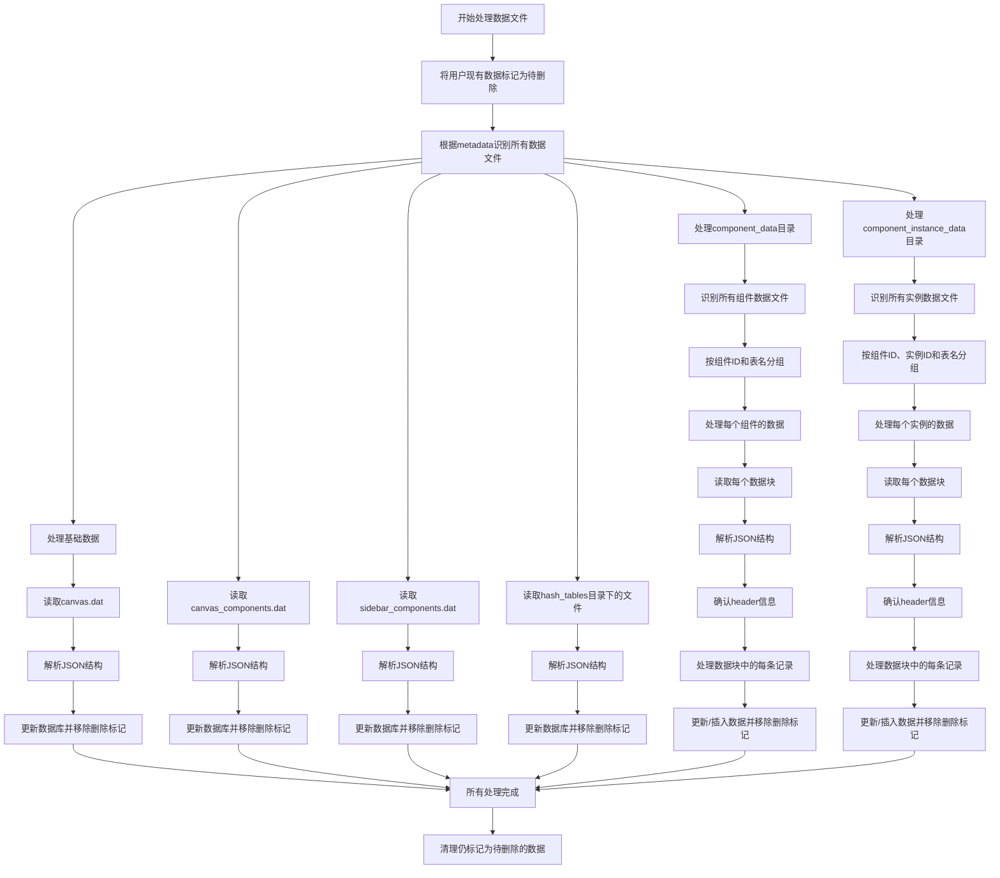

```mermaid
flowchart TD
    A[开始处理数据文件] --> B[将用户现有数据标记为待删除]
    
    B --> C[根据metadata识别所有数据文件]
    
    C --> D1[处理基础数据]
    D1 --> E1[读取canvas.dat]
    E1 --> F1[解析JSON结构]
    F1 --> G1[更新数据库并移除删除标记]
    
    C --> D2[读取canvas_components.dat]
    D2 --> E2[解析JSON结构]
    E2 --> F2[更新数据库并移除删除标记]
    
    C --> D3[读取sidebar_components.dat]
    D3 --> E3[解析JSON结构]
    E3 --> F3[更新数据库并移除删除标记]
    
    C --> D4[读取hash_tables目录下的文件]
    D4 --> E4[解析JSON结构]
    E4 --> F4[更新数据库并移除删除标记]
    
    C --> D5[处理component_data目录]
    D5 --> E5[识别所有组件数据文件]
    E5 --> F5[按组件ID和表名分组]
    
    F5 --> G5[处理每个组件的数据]
    G5 --> H5[读取每个数据块]
    H5 --> I5[解析JSON结构]
    I5 --> J5[确认header信息]
    J5 --> K5[处理数据块中的每条记录]
    K5 --> L5[更新/插入数据并移除删除标记]
    
    C --> D6[处理component_instance_data目录]
    D6 --> E6[识别所有实例数据文件]
    E6 --> F6[按组件ID、实例ID和表名分组]
    
    F6 --> G6[处理每个实例的数据]
    G6 --> H6[读取每个数据块]
    H6 --> I6[解析JSON结构]
    I6 --> J6[确认header信息]
    J6 --> K6[处理数据块中的每条记录]
    K6 --> L6[更新/插入数据并移除删除标记]
    
    G1 --> M[所有处理完成]
    F2 --> M
    F3 --> M
    F4 --> M
    L5 --> M
    L6 --> M
    
    M --> N[清理仍标记为待删除的数据]
```