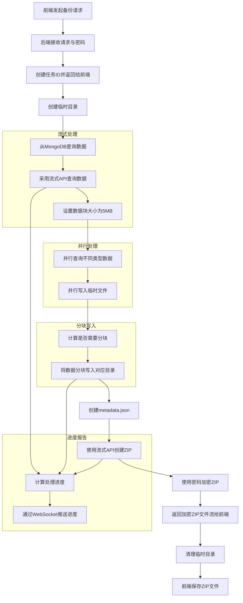

```mermaid
flowchart TD
    A[前端发起备份请求] --> B[后端接收请求与密码]
    B --> C[创建任务ID并返回给前端]
    C --> D[创建临时目录]
    D --> E[从MongoDB查询数据]
    
    subgraph 流式处理
      E --> F[采用流式API查询数据]
      F --> G[设置数据块大小为5MB]
    end
    
    subgraph 并行处理
      G --> H[并行查询不同类型数据]
      H --> I[并行写入临时文件]
    end
    
    subgraph 分块写入
      I --> J[计算是否需要分块]
      J --> K[将数据分块写入对应目录]
    end
    
    K --> L[创建metadata.json]
    L --> M[使用流式API创建ZIP]
    M --> N[使用密码加密ZIP]
    
    subgraph 进度报告
      F --> O[计算处理进度]
      K --> O
      M --> O
      O --> P[通过WebSocket推送进度]
    end
    
    N --> Q[返回加密ZIP文件流给前端]
    Q --> R[清理临时目录]
    R --> S[前端保存ZIP文件]
```