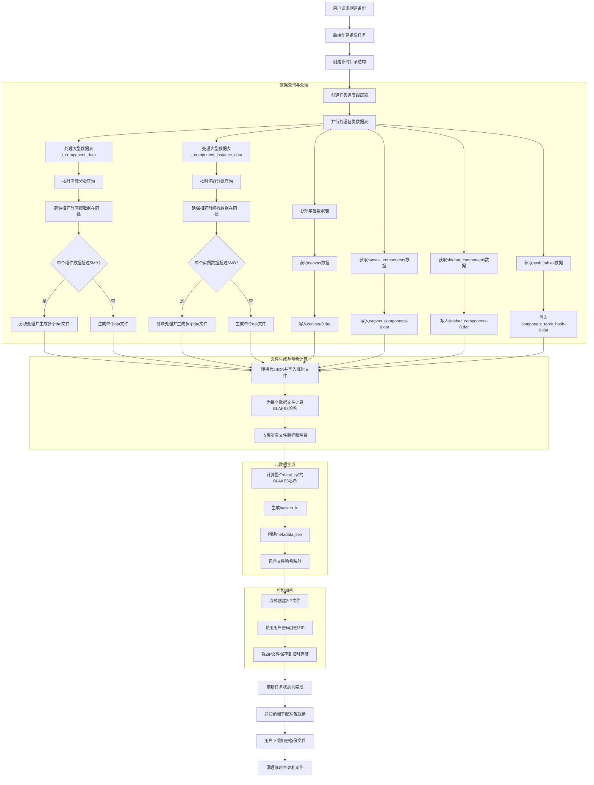

```mermaid
flowchart TD
    A[用户请求创建备份] --> B[后端创建备份任务]
    B --> C[创建临时目录结构]
    C --> D[创建任务进度跟踪器]
    
    subgraph 数据查询与处理
        D --> E[并行处理各类数据表]
        
        E --> F1[处理基础数据表]
        F1 --> G1[获取canvas数据]
        G1 --> H1[写入canvas-0.dat]
        
        E --> F2[获取canvas_components数据]
        F2 --> G2[写入canvas_components-0.dat]
        
        E --> F3[获取sidebar_components数据]
        F3 --> G3[写入sidebar_components-0.dat]
        
        E --> F4[获取hash_tables数据]
        F4 --> G4[写入component_table_hash-0.dat]
        
        E --> F5[处理大型数据表t_component_data]
        F5 --> G5[按时间戳分批查询]
        G5 --> H5[确保相同时间戳数据在同一批]
        H5 --> I5{单个组件数据超过5MB?}
        I5 -->|是| J5[分块处理并生成多个dat文件]
        I5 -->|否| K5[生成单个dat文件]
        
        E --> F6[处理大型数据表t_component_instance_data]
        F6 --> G6[按时间戳分批查询]
        G6 --> H6[确保相同时间戳数据在同一批]
        H6 --> I6{单个实例数据超过5MB?}
        I6 -->|是| J6[分块处理并生成多个dat文件]
        I6 -->|否| K6[生成单个dat文件]
    end
    
    subgraph 文件生成与哈希计算
        J5 --> L[转换为JSON并写入临时文件]
        K5 --> L
        J6 --> L
        K6 --> L
        H1 --> L
        G2 --> L
        G3 --> L
        G4 --> L
        
        L --> M[为每个数据文件计算BLAKE3哈希]
        M --> N[收集所有文件路径和哈希]
    end
    
    subgraph 元数据生成
        N --> O[计算整个data目录的BLAKE3哈希]
        O --> P[生成backup_id]
        P --> Q[创建metadata.json]
        Q --> R[包含文件哈希映射]
    end
    
    subgraph 打包加密
        R --> S[流式创建ZIP文件]
        S --> T[使用用户密码加密ZIP]
        T --> U[将ZIP文件保存到临时存储]
    end
    
    U --> V[更新任务状态为完成]
    V --> W[通知前端下载准备就绪]
    W --> X[用户下载加密备份文件]
    X --> Y[清理临时目录和文件]
```