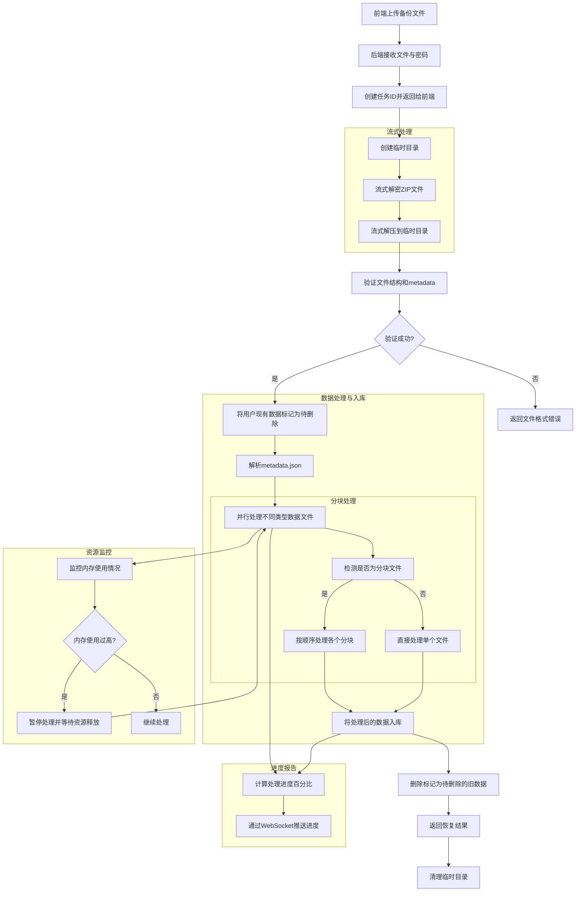

```mermaid
flowchart TD
    A[前端上传备份文件] --> B[后端接收文件与密码]
    B --> C[创建任务ID并返回给前端]
    C --> D[创建临时目录]
    
    subgraph 流式处理
      D --> E[流式解密ZIP文件]
      E --> F[流式解压到临时目录]
    end
    
    F --> G[验证文件结构和metadata]
    G --> H{验证成功?}
    H -->|否| I[返回文件格式错误]
    
    H -->|是| J[将用户现有数据标记为待删除]
    
    subgraph 数据处理与入库
      J --> K[解析metadata.json]
      K --> L[并行处理不同类型数据文件]
      
      subgraph 分块处理
        L --> M[检测是否为分块文件]
        M -->|是| N[按顺序处理各个分块]
        M -->|否| O[直接处理单个文件]
      end
      
      N --> P[将处理后的数据入库]
      O --> P
    end
    
    subgraph 资源监控
      L --> Q[监控内存使用情况]
      Q --> R{内存使用过高?}
      R -->|是| S[暂停处理并等待资源释放]
      S --> L
      R -->|否| T[继续处理]
    end
    
    subgraph 进度报告
      L --> U[计算处理进度百分比]
      P --> U
      U --> V[通过WebSocket推送进度]
    end
    
    P --> W[删除标记为待删除的旧数据]
    W --> X[返回恢复结果]
    X --> Y[清理临时目录]
```