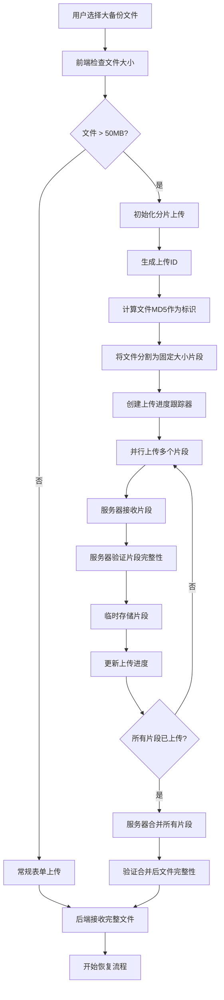

```mermaid
flowchart TD
    A[用户选择大备份文件] --> B[前端检查文件大小]
    B --> C{文件 > 50MB?}
    
    C -->|否| D1[常规表单上传]
    C -->|是| D2[初始化分片上传]
    
    D2 --> E[生成上传ID]
    E --> F[计算文件MD5作为标识]
    F --> G[将文件分割为固定大小片段]
    
    G --> H[创建上传进度跟踪器]
    H --> I[并行上传多个片段]
    
    I --> J[服务器接收片段]
    J --> K[服务器验证片段完整性]
    K --> L[临时存储片段]
    
    L --> M[更新上传进度]
    M --> N{所有片段已上传?}
    N -->|否| I
    
    N -->|是| O[服务器合并所有片段]
    O --> P[验证合并后文件完整性]
    
    D1 --> Q[后端接收完整文件]
    P --> Q
    
    Q --> R[开始恢复流程]
```